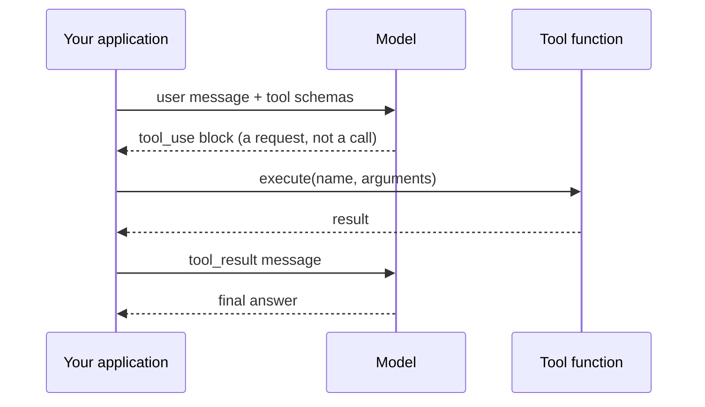

# Chapter 01 — One tool call

## TL;DR

A single tool call is the atomic unit of every agent. The model emits a structured request describing which function to run with which arguments; your code runs it; the result is fed back as another message; the model writes its final answer. No loop yet, no memory, no orchestration — one round-trip. This chapter is about getting that round-trip exactly right. Everything else in the course is variations and stacks on this same mechanism.

---

## Why this matters

Ask a model "what is the square root of 4,892,769" and it will approximate. Ask it "what is the weather in Tokyo right now" and it will fabricate. These are not bugs — they are correct behavior for a next-token predictor with no calculator and no internet.

Function calling does not make the model smarter. It gives the model a way to ask your code for things it cannot do itself. The model decides *when* to ask and *with what arguments*; the actual work happens where you can guarantee correctness — in your code. Once that split is in your head, you will write better tools and fewer broken agents.

---

## The concept

### The model writes a request; your code does the work

Imagine a chef who can read the dining room but cannot cook. The chef writes a ticket — "two eggs, scrambled, dry toast" — and hands it to the kitchen. The kitchen executes. The plate comes back. The chef garnishes and serves.

A language model with a tool is the chef. Its "ticket" is a structured block that says *which tool* to call and *what arguments* to use. It cannot run the function itself — it cannot run anything. Your application is the kitchen.

When something goes wrong, the question becomes diagnostic: did the chef write a bad order, or did the kitchen cook it wrong? Two different failures, two different fixes. Once you can separate them in your head, debugging stops feeling like magic.

### The four-step cycle



1. **Describe the tools.** Send the user message alongside a list of tool definitions — name, description, JSON schema for the arguments.
2. **Model emits a request.** If the model decides a tool is needed, the response contains a structured block — `tool_use` in Anthropic-shaped APIs, `tool_calls` in OpenAI-shaped ones — with a unique `id`, the tool's name, and the arguments.
3. **You execute.** Look up the function by name, validate the arguments against the schema, run it, capture the result.
4. **Feed the result back.** Send a `tool_result` message referencing the same `id`. The model now has the answer and writes its final reply.

```jsonc
// What the model emits in step 2 — a request, not a call.
{ id: "call_abc", name: "get_weather", input: { city: "Tokyo" } }

// What you send back in step 4 — same id, your result as content.
{ tool_use_id: "call_abc", content: "18°C, partly cloudy" }
```

Same protocol whether the tool fetches the weather, queries your database, or runs a shell command. The wire format does not care what the tool does; you do.

### The schema is the contract

A tool definition has three parts the model can see:

- **Name** — the identifier the model uses to invoke it.
- **Description** — prose telling the model *when to use it, when not to, and what it returns*. This is the model's only guidance. A vague description ("gets weather") leads to the model calling the tool at the wrong times; a precise one ("returns current conditions for a single city; do not use for historical data") leads to fewer mistakes.
- **Input schema** — JSON Schema for each argument: name, type, whether required, a per-field description.

```jsonc
// What a tool definition looks like — shape, not a specific SDK.
{
  name: "get_weather",
  description: "Returns current conditions for a single city. \
                Use for weather questions; do not use for historical data.",
  input_schema: {
    type: "object",
    properties: { city: { type: "string", description: "e.g. 'Tokyo'" } },
    required: ["city"]
  }
}
```

Ask your agent to write your first tool definition in your own language and stack. It will. Read what it produces and check that the description tells the model both *when* to call the tool and *when not to*. Half the bugs in production agents trace back to a description that did not say "do not use for X."

### Schema and function must move together

The most common silent failure in tool calling is schema drift. You rename a parameter in your code from `city` to `location`, but the schema still says `city`. The model faithfully emits `{ "city": "Tokyo" }`. Your dispatch code passes that to a function that expects `location`. The function blows up at runtime — and the model, which saw the schema, has no idea why.

The schema is the contract you sign with the model. Break the contract and the model has no way to tell. Treat the schema and the handler as one unit; if you change one, change the other in the same commit. Sebastian Raschka's coding-agent walkthrough makes this point especially well — worth a read if the schema-and-handler relationship still feels fuzzy.

### Bad inputs and errors are messages, not exceptions

The model emits arguments that match the schema *most of the time*. Sometimes it sends a string where you wanted an integer, omits a field marked optional but actually required by your code, or invents a value not in the allowed enum. The function itself can fail too — file not found, network timeout, permission denied. None of these should crash the conversation.

The pattern every production system converges on:

- Validate the arguments against the schema before executing.
- If validation fails, return the error as a `tool_result`. Don't throw.
- If the function fails at runtime, return *that* as a `tool_result` too — with a message useful to the model, not a stack trace.

The model is surprisingly good at recovering from errors it can read. It cannot recover from errors that killed the process. Wrapping exceptions as tool results is the difference between an agent that gracefully retries and an agent that silently stops mid-task.

### Tool results have shape

Two things about results that are not obvious until you have shipped one.

**The `id` round-trip is mandatory.** Every `tool_use` block has an `id`. Your `tool_result` must reference that same `id`. Lose the correlation and the model cannot match the result to the request — the conversation breaks in confusing ways. This is mechanical, easy to miss, and worth a unit test.

**Large results do not belong inline.** A grep that returns 50 KB, or a file read that returns 2 MB, will blow your context window, kill your prompt cache, and slow every subsequent turn. The pattern in production: if a result exceeds some threshold, send the model a snippet plus a pointer, and stash the full thing somewhere the model can ask for if it needs to. OpenCode wraps this in a dedicated truncation service; Hermes Agent enforces per-tool result-size limits. Your agent can build the equivalent for your stack in ten minutes.

### Provider-specific knobs worth knowing

The four-step cycle is universal. Providers layer on top of it a handful of controls and modes that change the cycle's behavior in useful ways. Six worth knowing before you go to production:

- **`tool_choice`.** Per-request control over whether the model *must* call a tool, *may* call any tool, *must not* call a tool, or *must call a specific tool*. Use *must-call-X* when you know the answer requires a tool (a routing layer); use *none* when you want pure text. Anthropic, OpenAI, Bedrock, and Gemini all support this in some form.
- **Parallel tool calls.** Modern providers let the model emit multiple `tool_use` blocks in one response. OpenAI exposes a per-request `parallel_tool_calls: false` switch to turn this off when your downstream cannot handle them out of order. Ch.02 covers how the loop dispatches multiple calls; the on/off switch is here.
- **Strict schema mode.** OpenAI's `strict: true` (and its equivalents elsewhere) guarantees the model produces arguments matching the JSON schema exactly. With strict on, you can skip half your validation code; with it off, you must defend at the dispatch boundary. Trade-off: strict modes restrict what the schema can express (fewer JSON Schema features supported).
- **Structured outputs.** A close cousin of tool calls. Instead of *call this tool with these args*, you tell the model *respond with JSON matching this schema*. Same JSON-schema discipline; different mechanism (a `response_format` field rather than a tool definition). Use it when the model's final answer is data, not an action.
- **Hosted (built-in) tools.** Providers ship tools that *they* execute, not you — web search, code execution, file search, computer use. The schema and tool-use shape look the same on the wire, but the result comes back without your dispatch code running. Trade-off: simpler integration, less control over what runs and how it bills.
- **Refusals and content filters.** The model can decline to call a tool (or any tool) on safety grounds. Anthropic surfaces this as a `refusal` block; OpenAI as a separate content type or finish reason. Treat a refusal like any other tool result — log it, surface it to the user, let the loop continue. Ch.18 covers the deeper threat model; this chapter just wants you to know refusals exist.

The wire format and exact field names move; the concepts are stable. Ask your agent for the current provider docs the day you wire any of these in.

### Providers differ; the concept does not

Anthropic uses `tool_use` and `input`. OpenAI uses `tool_calls` and `arguments`. Bedrock has its own shape. Higher-level SDKs (Vercel AI SDK, LangChain, custom adapters in Hermes Agent and OpenCode) normalize across them. The field names move around. The mechanism — model emits structured request, code runs it, result returns — is identical everywhere. If you can read one provider's docs, you can read another's in five minutes.

If you are building seriously, hide the wire format behind a small adapter so your tools do not care which provider you used last week. Both OpenCode and Hermes Agent do exactly this; ask your agent to scaffold one for your stack.

---

## Real-system notes

- **OpenCode** defines tools with typed schemas wrapped by a small `Tool.define` helper, tracks each call as a typed lifecycle object, and truncates large outputs through a dedicated service. Strong reference for "what does a clean tool registry look like."
- **Hermes Agent** uses `ToolEntry` objects bundling schema, handler, and per-tool result-size limits, and classifies tool errors into recoverable vs. fatal categories so the loop knows whether to retry.
- **OpenClaw** and **Paperclip** show that a "tool" need not be a local function. Channel adapters, workflow steps, shell commands, even calls to other agents all become tools the model can invoke, as long as they speak the same name-plus-schema-plus-result contract.

---

## Common failure cases

*These failures are durable; their fixes evolve fastest — each names the pattern and leaves current specifics to you and your AI partner.*

- **An unanswered tool request.** The conversation stops and the next call is rejected for a dangling `tool_use` — a swallowed exception, a half-answered parallel batch, or reordered messages. *Fix: the answer-every-tool_use invariant — reconcile the requested id set against the returned `tool_result` set before every model call.*
- **Well-formed but made-up arguments.** The JSON passes the schema, the tool runs against a hallucinated id or value, and the result is confidently wrong. *Fix: semantic validation past the schema — when a value parses but doesn't resolve, return a `tool_result` that names what was wrong and where to get a valid value (Ch.03).*
- **The model under- or over-calls the tool.** It fabricates an answer it had a tool for, or fires a tool on turns that needed none. *Fix: treat tool selection as a measured behavior driven by the tool description, and take the choice with `tool_choice` when it isn't the model's to make.*
- **A single tool call hangs the whole turn.** One slow dependency with no deadline freezes the turn with no error and no result. *Fix: a per-tool timeout that converts a hang into a readable `tool_result`, set below the turn budget (Ch.02).*
- **A large result wrecks every later turn.** A big result lands in the message array, re-sends each turn, and quietly raises cost, latency, and cache misses. *Fix: clip-and-persist at the tool boundary — a byte budget on the tool definition that returns a snippet plus a handle for the full thing.*

---

## Pair with your agent

A few prompts that work well on this chapter:

- *"Define one tool from my project in my language and stack. Make the description tell the model both when to use it and when not to. Then show me the exact JSON the model would emit when calling it."*
- *"Rename a field in my handler but not the schema. Mock a model call and show me precisely how the failure surfaces — and where I would catch it."*
- *"Wrap my tool so any thrown exception becomes a `tool_result` error the model can read and retry from. Show me the before-and-after."*
- *"Implement result truncation: if a tool returns more than 4 KB, send the model a summary and write the full result to a temp file the model can request."*
- *"Walk me through how OpenCode defines a tool and dispatches it, then write the equivalent in my stack — keeping the same shape but using my idioms."*

---

## What's next

One tool call is the atom. Ch.02 puts it inside a loop with stop conditions, retries, and the ability to chain calls into multi-step work. That is the boundary where chatbots end and agents begin.
