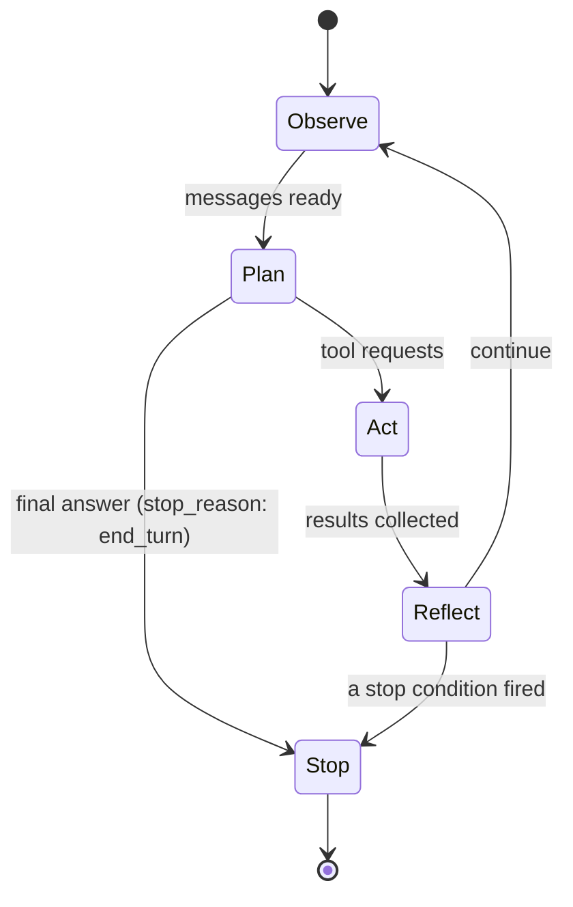
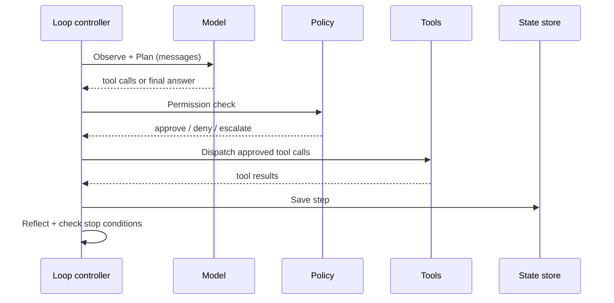

# Chapter 02 — The agent loop

## TL;DR

Ch.01 was one tool call. This chapter wraps that call in a loop. The model emits a tool request, your code runs it, the result goes back, and the model decides — again — whether to call another tool or stop. The hard part is not the loop body; it is the stop. Get the stop conditions wrong and you either build a chatbot that quits mid-thought or an agent that runs until your bill explodes. This chapter covers the shape of the loop, the spectrum of ways to end it, the failure modes hiding inside it, and the step boundary where every production capability — durability, observability, permissions, approvals, compaction — eventually attaches.

---

## Why this matters

A colleague hands you an agent that "works in the demo but runs forever in production." You read the code. The loop is there. The model emits tool calls. Tool results flow back. But nothing tells the model when to stop, and nothing tells the loop what to do when the model never says it is done. You add `if step > 20: break`. The loop exits — but now it exits mid-answer. You move the break to after the model's reply. It exits cleanly most of the time, but occasionally the model emits one more tool call after what looked like a final answer, and you silently miss results. You spend a day on this.

The fix is not more code. The fix is understanding that a loop has *several* ways to end, all of which need to be there, and that the model's own `stop_reason` is the primary signal — not a line counter.

---

## The concept

### One tool call is rarely enough

A simple question — "what's the weather in Tokyo" — fits in one call. A real one — "is the weather in Tokyo good for a picnic this weekend, and if so is my Saturday calendar free?" — needs at minimum a weather check, a calendar check, and a comparison. Two calls, possibly conditional on each other, possibly a third for clarification. You cannot pre-plan exactly how many calls are needed; the model must decide at each step, looking at what it has learned so far.

That is the agent loop: the Ch.01 cycle repeated, with a decision point after every round — keep going, or stop?

### The five stages

Picture a busy kitchen during service. The head chef (the model) calls out orders, the kitchen (your tools) executes them, the head chef tastes what comes back and calls out the next round — until the dish is plated and sent out. The sous-chef (your loop controller) does not decide when the dish is done. The head chef does. But if the head chef goes silent, or keeps calling out orders after the plate has already left the pass, the sous-chef needs a backup plan — a budget, a timer, a hand on the bell — to keep the kitchen from sliding into chaos.

Call the loop whatever you want — ReAct, plan-and-execute, think-act-observe. Underneath, the same five stages appear:

- **Observe.** Gather everything the model needs: the user's message, the system prompt, prior tool results, retrieved context. In practice, this is the growing message array.
- **Plan.** Call the model. It returns either tool requests, a final answer, or a question. Your code makes no decision here; the model does.
- **Act.** Execute the tool requests. One call or many — same dispatch you wrote in Ch.01, now inside a loop.
- **Reflect.** Append the tool results, with matching IDs, to the message array. The model can now see what happened.
- **Stop.** Check whether any stop condition has fired. If so, return. If not, back to Observe.



### What the loop actually carries

The loop is not just walking the message array. Between iterations it also holds:

- **Tokens spent so far** — for budget checks.
- **Step count** — for the iteration cap.
- **A short history of recent tool calls** — for doom-loop detection (below).
- **An abort token** — so the user, or another part of the system, can cancel mid-loop.
- **The system prompt** — kept byte-stable across iterations so prefix caches keep hitting (Ch.04 explains why).

You only realize how much the loop carries the first time you try to *resume* one from a crash. That is Ch.08's problem. For now, just know the message array is not the whole story.

### Stop conditions are a spectrum, not a checklist

Every production loop uses several stop conditions, layered from softest to hardest:

- **Model-driven stop.** The model returns no tool calls and a finish reason of `end_turn` (or `stop` on OpenAI-shaped APIs). This is the primary signal — the model considers itself done.
- **Explicit `final_answer` tool.** Add a `final_answer(text)` tool to the registry. Make it the only legal way for the model to submit a result. This forces intentional finishing, prevents drift into extra calls after the answer exists, and gives you a clean canonical output to log.
- **Grace call.** Some systems give the model one last turn when the budget is almost exhausted, with a message in the prompt: "you have one turn left; wrap up." The model usually closes cleanly. Without this, hard caps cut off mid-thought. OpenClaw is the clearest reference for this pattern.
- **Step cap.** A hard ceiling on iterations — typically 10–50, sometimes ~90 in long-running assistant systems. This is the safety net, not the primary stop. If your loop ends here most of the time, something is wrong upstream.
- **Token or cost cap.** Exit when total tokens or accumulated cost crosses a threshold. Return whatever has been produced, labeled as partial.

The shape on the wire:

```ts
// Minimal loop — the shape, not your final code.
for (let step = 0; step < MAX_STEPS && totalTokens < TOKEN_BUDGET; step++) {
  const response = await llm.complete({ messages, tools });
  totalTokens += response.usage.totalTokens;

  // Model-driven stop or explicit final_answer.
  if (isFinalAnswer(response)) return finalize(response);

  // Act + Reflect.
  for (const call of response.toolCalls) {
    const result = await dispatch(call.name, call.args);
    messages.push(toolResult(call.id, result));
  }
}
return partialResult(messages, "budget_exhausted");
```

Ask your agent to translate this into your stack, then add grace-call behavior so you do not silently cut off mid-thought.

### Sometimes the right answer is to compact, not continue or stop

After each step, the loop actually has three choices, not two: continue to the next iteration, stop because a condition fired, or *compact* — pause, shrink the message array, then continue. Compaction is triggered when the context window is filling up; OpenCode's session processor watches a usable-context calculation, Hermes Agent triggers it from a token-overflow check. The mechanics — what to clip, what to summarize, what to keep verbatim — belong to Ch.05. What belongs *here* is the recognition that the loop has a third lever, not just an on/off switch, and that the step boundary is where it gets pulled.

### Errors are also turns

When a tool fails or the model emits a malformed tool call, the right move — almost always — is to append the error as a `tool_result` and keep looping. The model is good at reading an error and either retrying with corrected arguments or pivoting to a different approach. Throwing an exception out of the loop is almost never the answer.

Two error classes matter:

- **Transient.** Network glitch, rate limit, model overloaded. Retry with backoff (production systems use schedules from a few seconds up to two hours). On repeated failure, fall back to a *compatible* model — one that supports the same tool schemas, has at least the context window this turn needs, and meets the task's reasoning and content-policy requirements. A fallback that lacks the primary's tool format, context size, or policy parity is not a fallback — it's a different failure mode. Hermes Agent and OpenClaw both ship configurable fallback chains; the chain definition is where compatibility is declared.
- **Permanent.** Bad credentials, schema validation failure, tool not in the registry. Surface immediately. No amount of retrying will fix it.

Every system worth studying converges on the same shape: classify the error first, then route to retry, fallback, or surface. Ask your agent to wire `classify_error(err) → action` into your loop and write the tests that prove each class routes correctly.

### Doom loops and how to catch them

The most common runaway pattern is the *doom loop*: the model calls the same tool with the same arguments three or four times in a row, gets the same useless result, and never notices it is stuck. OpenCode and Hermes Agent both ship explicit detection — the usual rule is "if the last three tool calls have identical names and identical arguments, pause and ask for permission to continue."

Byte-for-byte equality catches most cases. It does not catch slow loops where the call shape changes but no real progress is made — `read(file, offset=0)` → `read(file, offset=100)` → `read(file, offset=200)` — where the model keeps "looking" without ever finding. For those you need either a tool that tracks its own progress or a heuristic on how much the message array has grown without producing useful output. Most teams start with byte-for-byte, add a step cap, and accept that the cost budget will catch the subtler stuck states.

### Parallel tool calls in one turn

Modern providers let the model emit multiple tool requests in a single response. If the tools are independent and safe to run concurrently, you should — it cuts wall-clock latency substantially. The pattern in OpenClaw and Hermes Agent: mark each tool as `concurrency_safe: true | false`, and run safe ones on a worker pool (eight workers is a common cap) while serializing the rest. Read-only tools are safe. Anything that writes, sends, or pays is not.

### Streaming, partial deltas, and refusals

Modern providers stream the response in chunks: text tokens, reasoning blocks, tool-use blocks, finish reasons, and sometimes refusals or safety stops. The loop has to assemble these into a coherent picture before it acts. Five concerns that show up only in streaming mode:

- **Tool-call arguments arrive incrementally.** OpenAI-style streaming emits tool-call arguments as JSON-string deltas — `{"city"` then `: "Tok` then `yo"}` — across multiple events. The loop must accumulate all deltas for a given tool-call `id` before parsing and dispatching. Dispatching on a partial fragment is the most common streaming bug.
- **Malformed JSON in args.** Even after accumulation, the model can emit JSON that does not parse — a trailing comma, an unterminated string, a key without a value. Treat it like any other recoverable error: return a `tool_result` saying *"your args did not parse; here is the error; try again,"* and let the next turn correct it. The model is good at fixing its own JSON when shown the parse error.
- **Refusals as a terminal turn.** The model can decline to call a tool (or any tool) on safety grounds. Anthropic emits a `refusal` block; OpenAI surfaces a different content type or finish reason. To the loop, a refusal ends the turn with a refusal message, not a tool result. Log it; surface it to the user; do not retry blindly against the same prompt.
- **Safety stops mid-stream.** A response can be cut short by the provider's content filter — the stream ends with a `finish_reason` of `content_filter` (OpenAI) or its equivalent. Treat as a terminal failure for that turn; surface the partial output if useful; do not retry blindly (the same filter will fire again on the same input).
- **Cancellation mid-stream.** The abort token from the next subsection applies to the stream too, not just the next turn boundary. A clean cancel stops reading from the provider, closes the connection, and does not commit any half-formed tool call. Anything already dispatched gets a *"user cancelled"* tool_result.

The wire format differs across providers; the loop's response shape — accumulate, validate, dispatch, or surface — is the same everywhere.

### Interrupts and cancellation

A user pressing Ctrl-C, a timeout firing, a parent process deciding the loop has gone on long enough — all need to propagate inward. The pattern: every loop holds an abort token, every long-running step checks it, and a tripped token cleanly unwinds with a partial result rather than tearing the process down. "Interrupt arrived mid-tool-call" deserves its own thought: let the tool finish (or have it check the token itself) rather than orphaning a half-done write.

### Step boundaries are where everything attaches

The transition between Act and Reflect — after results are collected, before they are appended — is the natural checkpoint. At that moment the loop holds a complete unit of work: one plan, one set of tool calls, one set of results. Five categories of production capability hang off this boundary:

- **Durability.** Save state. Survive a crash without repeating expensive work. → Ch.08.
- **Observability.** Emit a structured trace per step: tools called, tokens used, latency, error counts. → Ch.16.
- **Permission checks.** Gate the Act phase before dispatching. → Ch.03, Ch.12.
- **Human approvals.** Pause and wait for sign-off before high-risk actions. → Ch.12.
- **Context compression.** Clip oversized results, deduplicate, summarize older turns. → Ch.05.



The loop body is small. The boundary around it is where the production system actually lives.

---

## Real-system notes

- **OpenCode** runs the loop inside a `SessionProcessor` that streams events for every part of every step, dispatches tools through a worker pool, and triggers compaction when the context window starts to fill.
- **Hermes Agent** runs a similar loop in `run_conversation` with a max-iterations cap near 90, a credential pool that rotates API keys on rate-limit errors, and a fallback model chain for context-overflow recovery.
- **OpenClaw** is the clearest reference for graceful-stop behavior: it counts iterations, gives the model a *grace call* when the budget is one shy, and only then forces a hard stop.
- **Paperclip** does not run the inner loop itself — adapters do. Its job is the loop *around* the loop: scheduling, heartbeats, retry policies with delays from minutes to hours, liveness reviews, durable run logs.

---

## Common failure cases

*These failures are durable; their fixes evolve fastest — each names the pattern and leaves current specifics to you and your AI partner.*

- **Runs only ever stop at the step cap.** Long runs finish at the iteration ceiling instead of a model-driven `end_turn`, so every run pays for the maximum number of model calls. *Fix: a `final_answer` stop tool as the only legal way to finish, plus a stop-reason metric you alarm on (Ch.16).*
- **A transient blip becomes a retry storm.** A brief provider hiccup spikes load and bill far past its cost as synchronized retries slam the provider and expensive calls re-run silently. *Fix: full-jitter backoff to de-sync the herd, classify-before-retry with a bounded budget, and a circuit breaker that fails fast.*
- **The loop is stuck but the doom-loop filter never trips.** The agent spins making no real progress while the byte-for-byte equality detector sees changing call shapes and reports everything fine. *Fix: a no-progress heuristic alongside the equality check — progress-bounded looping where every step must advance a measurable quantity.*
- **Parallel tool calls that were not safe to parallelize.** Concurrent execution made things faster and occasionally, nondeterministically, wrong as a too-generously-marked tool raced on shared state. *Fix: default `concurrency_safe` to false and partition each batch — run the proven-safe set concurrently, serialize the rest in emission order (Ch.03).*

---

## Pair with your agent

A few prompts that work well on this chapter:

- *"Translate the minimal loop pseudocode into my stack. Add the grace-call behavior and the four other stop conditions. Show me where each one fires."*
- *"Implement doom-loop detection: byte-for-byte equality on the last three tool calls. Walk me through a test case where it catches a real stuck pattern and one where it misses."*
- *"Classify these errors as transient or permanent — rate limit, schema validation failure, tool-not-found, model overloaded, expired credentials — wire `classify_error → action` into my loop, and write the tests."*
- *"Wire an abort token through my loop. Show me what happens when a user cancels mid-tool-call vs. mid-model-call, and how the partial result is shaped."*
- *"Walk me through how OpenCode's SessionProcessor decides between continue, compact, and stop. Then write the equivalent in my stack — keeping the same shape, using my idioms."*

---

## What's next

You have a loop. The next thing the loop needs is tools it can trust. Ch.03 is about the contract beyond the schema — argument validation, side-effect classification, idempotency, the difference between a recoverable error and a fatal one, and why safe paths matter more than safe code.
