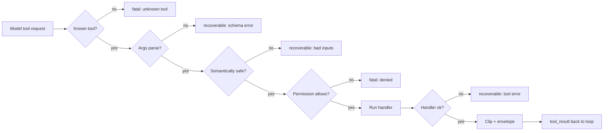

# Chapter 03 — Tools the agent can trust

## TL;DR

A tool's schema (Ch.01) is what the model sees. The contract beyond the schema is what the loop needs. A production tool also carries metadata — read-only or destructive, safe to parallelize, idempotent, open-world — that the loop reads before dispatching. It runs through a validation pipeline in a specific order: known, then typed, then semantically safe, then permitted, then executable. It returns a result envelope so failures become turns instead of crashes. And it clips its output for the model without losing the full version for you. This chapter is the small invariants that turn a tool from "a function the model can call" into "a function the agent can be trusted with."

---

## Why this matters

Three short scenarios.

You give an agent a shell tool. The model writes `rm -rf` to the wrong path. There was no permission gate, no sandbox, no way for you to inspect the command before it ran. The agent did exactly what you asked: it called the tool.

You give an agent an email tool. A transient network blip times out the first call. The loop retries. The customer gets two emails. The "send" was not idempotent.

You give an agent a deploy tool. It returns `"ok"` quickly. The model assumes success and continues. Three hours later you find the deploy never actually reached the cluster — the API silently dropped the request and the tool returned its optimistic default.

None of these are model failures. They are tool-system failures. They are fixed by treating the tool boundary as a contract — with metadata, validation, errors, and results, all in a deliberate shape.

---

## The concept

### A tool is also a way the model thinks

Tools are the model's hands. Less obviously, tools are also the model's *vocabulary*. A tool called `edit_file(path, new_content)` teaches the model to reason in edits. A tool called `run_shell(command)` teaches it to reason in bash. A tool called `book_meeting(participants, when)` teaches it to reason about scheduling.

Designing a tool is therefore not just an interface decision — it is a prompt decision. Every tool name and schema sits in the system prompt every turn (Ch.04 explains why that matters for caching). The model reads them, internalizes them, and reaches for them. A small set of well-named tools with crisp schemas produces sharper reasoning than a large set of generic ones. *Fewer hands, sharper hands.*

OpenCode makes this concrete: the `explore` agent gets read-only tools (search, read, glob); the `build` agent adds writes; specialist agents get further-tailored sets. The model is not made smarter by handing it more tools — it is made smarter by handing it the *right* ones.

### The validation pipeline

Five stages every tool call goes through before it touches a real side effect:



Order matters. Cheap checks run first — *known* before *typed*, *typed* before *semantic*, *semantic* before *permission*, *permission* before *execute*. A permission denial after parsing a huge JSON blob wastes tokens. A semantic check (path is inside workspace) after the handler has already opened the file is too late. Every system in the references converges on roughly this order, even when they spell the stages differently.

Each stage decides whether the failure is recoverable (model can read the error and try again — schema error, bad path, file not found) or fatal (loop should stop or escalate — unknown tool, permission denied, expired credentials). That recoverable/fatal split is what Ch.02's loop reads.

### Tool metadata — flags the loop reads, not the model

Beyond the schema the model sees, every tool carries a small set of flags the loop consumes:

```ts
// Tool definition — schema is the model's view; the rest is the loop's view.
{
  name: "edit_file",
  description: "Replace the contents of a single file in the workspace.",
  input_schema: { /* model's view */ },

  // Loop's view.
  read_only:        false,
  destructive:      true,    // permission gate + approval (Ch.12)
  concurrency_safe: false,   // cannot run parallel with siblings (Ch.02)
  idempotent:       true,    // safe to retry on transient failure
  open_world:       false    // result is deterministic given args
}
```

What each flag enables:

- **`read_only`** — eligible for restricted-mode agents (e.g. an `explore` agent that cannot mutate state).
- **`destructive`** — triggers a permission ask or human approval (Ch.12).
- **`concurrency_safe`** — eligible for the parallel-dispatch worker pool from Ch.02.
- **`idempotent`** — the loop can retry the same call on transient failure without explicit idempotency keys.
- **`open_world`** — the result can change between calls (web fetch, time, random); the harness must not cache or deduplicate it the way it would a `read_file`.

OpenCode encodes the equivalent on its `Tool.Def` interface; Hermes Agent attaches similar flags at registration; OpenClaw and Paperclip both classify tools by side-effect class to drive their approval and retry policies. The exact names vary; the *idea* — that the schema is for the model and the metadata is for the loop — is universal.

### The dispatch contract: what the tool can assume

The metadata above is what the loop reads from the tool. There is a symmetric direction: what the tool can read from the loop. By the time your handler is called, the dispatcher has already done the work in stages 1–4 of the validation pipeline. The handler can rely on it. The tool receives a `ToolContext` (or `ToolUseContext`) that carries:

- **Workspace root** and configured sandbox paths — already resolved.
- **Identity** of the calling agent (so the tool knows it is running under `explore` vs. `build`, and can tailor behavior accordingly).
- **The abort token** the loop is honoring — long-running tools should check it periodically.
- **Logger and tracer** preconfigured with the current step, tool name, and call id, so every log line from the tool ties back to the trace (Ch.16).
- **Per-tool budgets** the harness enforces (max calls per session, max bytes returned, max wall-clock per call).

The tool relies on these. It does not re-check permissions, does not re-resolve paths, does not invent its own logging file. That separation — *the dispatcher is responsible for the boundary, the tool is responsible for the work* — is what makes both sides independently testable. OpenCode's `Tool.Def` and Hermes Agent's `ToolEntry` both encode it explicitly; OpenClaw and Paperclip pass equivalent context through their hook surfaces.

A useful test for whether your boundary is clean: can you call `send_message({to, body}, ctx)` directly in a unit test, without spinning up the loop? If yes, your contract is well-shaped. If no, the tool has reached around the dispatcher for something it should have received as part of `ctx` — and you have a leak you will eventually pay for.

### Sanitize before you validate

Before the schema parser ever sees the model's arguments, there are a few cheap cleaning steps worth running. The model can emit bytes that are technically valid JSON but operationally dangerous: stray null bytes, lone surrogate pairs from a truncated stream, ANSI escape sequences pasted in from a tool result, BOMs, mismatched line endings. Hermes Agent's conversation loop strips these on the way in; production shell tools across the references reject any argument containing `\0` outright.

The rule of thumb: *sanitize on the way in, escape on the way out, never invert the order.* On the way in, you are protecting the rest of your pipeline from weird bytes. On the way out — passing a string to a subprocess, a shell, a SQL driver, a templating engine — you are protecting the world from whatever the model just emitted, no matter how clean it looked.

### Validation is more than "JSON parses"

Schema validation is necessary and not sufficient. The model can emit JSON that parses cleanly and is still wrong:

- A path like `../../etc/passwd` that string-matches a workspace prefix but escapes it on resolution.
- A URL pointing at `localhost:25` that your URL allowlist would refuse.
- A `limit: 100000` that parses as a positive integer but will blow your context window.
- An identifier like `user_id: "self"` that the model invented from training data, not from your domain.

The pattern: *semantic* checks live next to *schema* checks, and they run *before* the handler. The canonical case is path safety — never decide a path is inside the workspace by string prefix, and never trust *textual* resolution alone. `path.resolve` is purely lexical: it cannot see that `workspace/innocent_link` is a symlink to `/etc/passwd`. A workspace check that does not follow symlinks (via `realpath`, `openat` with `O_NOFOLLOW` per component, or your platform's equivalent) will pass the wrong path through and the handler will happily read or write outside the boundary:

```ts
// Resolve symlinks, then compare structurally. Textual resolution alone is not safe.
async function resolveInsideWorkspace(workspaceRoot, requestedPath) {
  // Resolve symlinks on the root itself — sometimes the workspace is reached via a link.
  const root = await fs.realpath(workspaceRoot);

  const joined = path.resolve(root, requestedPath);

  // If the target exists, resolve its symlinks fully.
  // If it does not exist yet (about to be created), resolve symlinks on the
  // deepest existing ancestor; never operate on an unresolved path.
  const real = await realpathOrParent(joined);

  const relative = path.relative(root, real);
  if (relative.startsWith("..") || path.isAbsolute(relative)) {
    return { ok: false, fatal: true,
             error: `Path is outside the workspace: ${requestedPath}` };
  }
  return { ok: true, value: real };
}
```

The same shape applies to URL allowlists (resolve to a host *and* check after redirects, never trust the input URL alone), to shell tools (allowlist the program, never `bash -c`), and to identifiers (look the value up in your domain before you trust it). The lesson generalizes: any check that operates on the *string form* of a name — path, URL, table, identifier — is incomplete until you resolve the name to the thing it actually refers to. Every workspace-escape bug in production agents traces to either a `startsWith` or a missing `realpath`.

### Dry-run is a validation pattern, not just an approval UI

For a tool that mutates the world, *"can you describe what you would do without doing it?"* is a validation pattern in its own right. A `delete_file` tool with a `dry_run: true` argument that returns *"would delete /workspace/foo.txt (143 bytes, last modified 2 weeks ago)"* without actually deleting catches mistakes before they happen — both human mistakes (you misread the args in the approval dialog) and model mistakes (the model guessed the wrong path from a stale memory).

Production systems use this for approval UX (Ch.12 covers the dialog), but the underlying mechanism — *the tool can preview its own effect* — is a validation primitive. Build it in once and you get four things at once: a clearer approval UI, a path for the model to self-check before destructive action, a useful debug surface, and a scaffold for tests. Not every tool needs it. Reads do not. Anything destructive should.

### Errors come back as messages, with a hint

Ch.02 introduced the rule that errors are turns, not exceptions. The shape of that turn matters. The loop reads three things from a tool result:

```ts
// Result envelope — what the loop sees, regardless of success or failure.
type ToolResult =
  | { ok: true,  content: string,
                 meta?: { duration_ms, file_hash, exit_code } }
  | { ok: false, recoverable: boolean,
                 code: string, message: string, hint?: string };
```

The `hint` field is the secret weapon. A bare error message — `"file not found"` — sends the model into guessing. An error with a hint — `"file not found; available files in this directory: src/index.ts, src/util.ts"` — points the model at the next move. Hermes Agent's tool errors carry this kind of structured guidance, and the leading coding agents in production do the same. It costs almost nothing and visibly shortens the loop.

What counts as *fatal* depends on the harness's recovery affordances, not on the error label. *Permission denied* can be an approval gate (Ch.12) when a human is reachable. *Unknown tool* can be a registry refresh when tools are loaded dynamically or the model just guessed a name close to a real one. *Expired credentials* can be a credential repair when the harness has a refresh path. The tool reports what it knows — the error code and the resource it could not reach. The loop decides whether to escalate, ask, repair, or stop. Reserve `recoverable: false` for the residual: anything the harness has no recovery affordance for. Everything else — including most of what feels like "errors" from your perspective — is recoverable, and the model is surprisingly good at recovering from a well-shaped message.

### Idempotency is part of the contract

Retries are normal in agent systems (Ch.02 covered transient errors and fallback chains). Anything with a side effect needs to be safely retryable. The standard pattern is an idempotency key derived from the call:

```ts
// Scope the key by operation intent — not just tool name and args.
const key = sha256(JSON.stringify({
  tool: "send_message",
  args,
  version: 1,
  // Scope: a deliberate repeat at a different turn must hash differently.
  // Prefer a downstream idempotency token when the API exposes one;
  // otherwise scope by the unit of work the user thinks they are doing.
  scope: args.idempotency_key ?? ctx.turn_id ?? ctx.run_id
})).slice(0, 32);

async function send_message(args, ctx) {
  const cached = await ctx.idempotency.get(key);
  if (cached) return ok(cached.result);

  const result = await ctx.messageClient.send(args);
  await ctx.idempotency.put(key, { result });
  return ok(result.messageId);
}
```

Reads are naturally idempotent — calling `read_file` twice returns the same bytes. Writes, sends, payments, comments, and workflow transitions need an explicit key. If a tool is `idempotent: true` in its metadata *and* uses a key like this, the loop can retry on any transient failure without asking you first.

A small note that catches teams off guard: the key encodes *intent*, not *delivery attempts*. Hash the arguments so a retry of the same call hits the cache. Hash the operation's scope — turn, run, or downstream idempotency token — so a *deliberate* repeat at a different turn (the user says *"actually, send that same message again, on purpose"*) produces a different key and goes through. Hashing tool-plus-args alone is too coarse: it would dedupe an intentional re-send. If the downstream system has its own idempotency header (Stripe, most modern HTTP APIs, every well-built queue), thread it through and let the downstream be the source of truth instead of recomputing one above it.

### What the model sees vs. what you keep

A tool's result has two audiences. The model needs something compact, structured, and free of noise. You — and a human auditor later — need the full thing.

The pattern: *clip for the model, persist in full.* OpenCode's truncation service writes the full output to a temp file and returns a snippet plus a pointer; Hermes Agent enforces per-tool maximum result sizes; Paperclip chunks long adapter output into 64-KB blobs in its event store. The shape is identical across them: the message array is a *display* surface, not a *storage* surface.

Three habits come with this:

- **Include metadata alongside content.** A `read_file` result carries the byte count and a hash; a shell command carries the exit code and duration; a network call carries the status code. The model often reasons from these as much as from the body.
- **Make truncation visible.** Silent clipping teaches the model a false view. Insert a clear marker — `...[120 KB clipped; full result at <ref>]...` — so the model knows it does not have the whole thing and can ask for more.
- **Watch for the silent-success trap.** A tool returning `"ok"` is not proof anything happened. If you can verify (echo the row, hash the file, re-read the resource), do it inside the tool and put the proof in the metadata. The deploy tool from the opening scenario would have caught its own failure if it had returned the cluster's view of the resource instead of an optimistic default.

### Output schemas, versioning, and provenance

The schema in Ch.01 describes the tool's *input*. A production tool also declares an *output schema* — the shape of what it returns — and a few small contracts around it that pay back the moment you replay a session, upgrade a tool, or audit a result.

- **Output schema.** Declare the result shape alongside the input schema. Validate the handler's return against it before clipping. If a downstream API quietly changes from `{ id, status }` to `{ id, state }`, you want a recoverable validation error at the tool boundary, not a silent pass-through that the model later misinterprets. Output schemas also let one tool's result feed cleanly into another's input — the model reasons better when it knows what fields will be present.
- **Schema versioning.** Every tool carries a version. Bump it on any breaking change to the input *or* output schema. The version flows into idempotency keys (above), prompt-cache fingerprints (Ch.04), and eval baselines (Ch.16) so older runs continue to reference the old contract instead of silently picking up the new one. Renaming an argument is a breaking change. Adding an optional argument with a default is not.
- **Dependency risk.** A tool's code is not a closed system — it imports libraries, talks to downstream APIs, sometimes shells out to system binaries. Every one of those is a failure surface the model cannot reason about: a degraded upstream or a library regression turns into a confusing error and the agent loops on it. Declare external dependencies on the registry entry (which API, which library version, which binary), pin them, and map dependency failures to a clear code like `upstream_unavailable` so the `hint` reads *"downstream service is degraded, try again in a few minutes"* rather than a stack-trace fragment.
- **Result provenance.** Every result carries, at minimum: tool name and version, timestamp, the downstream resource that produced it (API endpoint, file path, DB query), and the identity or scope used. The model rarely needs all of this; the human auditing the session, the engineer replaying it, and the eval pipeline gating the next deploy all do. Persist it in full; clip it from the version the model sees.

OpenCode's tool lifecycle objects carry version and timing on every dispatch. Paperclip's run logs encode the equivalent per step — adapter, version, downstream call, duration. Hermes Agent stamps a tool version into every memory-backed result so the curator (Ch.07) can re-derive a memory if the producing tool's contract has moved on. The pattern is universal once a system has been audited or replayed once.

### Hooks bracket every dispatch

The dispatch path is the choke point for everything that wants to observe or modify tool execution. The pattern across systems — OpenCode's bus events, Hermes Agent's `pre_tool_call` / `post_tool_call` hooks, OpenClaw's plugin lifecycle, Paperclip's adapter hooks — is the same: a small ordered list of callbacks around each call.

The five things teams almost always end up wiring through hooks:

- **Tracing.** Emit a span around every call: tool name, args, duration, result size, error. Ch.16 lives here.
- **Redaction.** Scrub PII, secrets, and credentials from args and results *before* they are logged or shown.
- **Transform-input.** Inject defaults (`cwd`, locale, current user), normalize paths, append safe flags.
- **Transform-output.** Strip ANSI escapes from terminal output, summarize binary, attach computed metadata (hashes, byte counts).
- **Cost and budget tracking.** Count tokens consumed by results, enforce per-tool call budgets, log against Ch.17's cost ledger.

Two small rules pay for themselves later: pre-hooks should run in registration order, post-hooks in reverse (like middleware) so cleanup matches setup; and any hook that mutates args or results should be explicit about it in its name (`redact_secrets_in_result`, not `process_result`). You will not need any of this on day one. You will reach for all of it by week two. Wire the seams in early; they are easier to remove than to retrofit.

### Validation failures are also signals

Every recoverable error you return to the model — schema failure, path escape, missing argument, unknown enum — is a data point. The shape of those failures over time tells you which tool descriptions are unclear, which arguments the model is confused about, and which tools the model is reaching for in the wrong situations. Log them with structure (tool name, failure stage, model-emitted args, error code) and you have an evaluation surface for free.

A small example: if `read_file` fails with *"file not found"* twice a day and the model is consistently asking for `src/index.js` in a project whose entry point is `app.ts`, that is not a model failure — it is a *description* failure. The tool description should mention the project's entry-point convention, or you should add a `find_entry_point` helper. Without the structured log, you would never have noticed.

Ch.16 covers the trace pipeline in full. The validation boundary is one of its richest sources of signal, and it is one of the cheapest places to start capturing it. From day one.

### Fewer tools, sharper reasoning

Worth restating because it is the cheapest improvement most teams ignore: an agent with twelve crisp tools outperforms an agent with thirty generic ones. Each extra tool is an opportunity for the model to reach for the wrong one, a chunk of system prompt the model has to skim, and a permission you have to think about. When in doubt, reduce.

OpenCode's per-agent tool reduction is the clearest reference: the `explore` agent simply does not have an `edit` tool — it cannot do the wrong thing because the wrong thing is not on the table. Define your tool sets per agent profile, not once globally. The loop chooses the agent; the agent chooses the tools.

A second-order benefit: when your tools are reduced per agent, your validation surface shrinks too. The `explore` agent's tools are all `read_only: true` and `concurrency_safe: true`, which means it can dispatch six of them in parallel with no permission checks. The `build` agent pays for its broader power with stricter gating. That asymmetry is good design, not friction.

---

## Real-system notes

- **OpenCode** is the strongest reference for tool contracts in a coding-agent setting: typed schemas, per-agent registries, metadata flags driving parallelism and permissions, a dedicated truncation service for results, and bus events around every dispatch. If you read one production codebase to learn this chapter's patterns, this is it.
- **Hermes Agent** uses a `ToolEntry` carrying handler, schema, async flag, and per-tool size limits; classifies errors at the boundary into recoverable/transient/fatal; sanitizes incoming text in the conversation loop; and runs a thread-pool for concurrency-safe tools.
- **OpenClaw** plugs in `pre_tool_call`, `post_tool_call`, and several other hook points around every dispatch — useful study for how production systems wire telemetry, redaction, and permission UX into one boundary.
- **Paperclip** is the example of these contracts pushed up a level: adapters are tools, run logs are results, approvals are permission gates, and chunked event storage is "clip for the model, persist in full" at orchestration scale.

---

## Common failure cases

*These failures are durable; their fixes evolve fastest — each names the pattern and leaves current specifics to you and your AI partner.*

- **Valid arguments, wrong call.** The schema validator says yes and the tool does the wrong thing anyway — a well-formed `limit` that blows the context, an invented id, a path that escapes the workspace. *Fix: run a semantic check next to the schema check and before the handler, and never silently coerce a bad value into a plausible one.*
- **The tool returns "ok" and nothing happened.** The model reports success, the loop moves on, and the side effect never landed. *Fix: verify-by-read-back inside the tool and put the proof in the metadata; return a pending handle when read-back is impossible.*
- **A retry sends it twice — or refuses to resend on purpose.** An idempotency key scoped at the wrong grain causes a double-send, or silently swallows a deliberate repeat. *Fix: scope the key by the unit of work the user thinks they are doing, and let the downstream own dedup whenever it can (Ch.02).*
- **Clipping blinds the model — or the full result blows the budget.** The model reasons from output it only half-received, or one giant result torches the context for the rest of the session. *Fix: clip-for-the-model, persist-in-full — make truncation loud, give the pointer a followable retrieval path, and budget result bytes at the dispatch boundary.*

---

## Pair with your agent

A few prompts that work well on this chapter:

- *"Add metadata flags (read_only, destructive, concurrency_safe, idempotent, open_world) to my tool definitions. Show me how my loop should branch on each flag, and write a small test for each."*
- *"My tools accept paths from the model. Implement `resolveInsideWorkspace` in my language, then write tests that exercise `..` traversal, symlink escape, an absolute path, and a path with a NUL byte."*
- *"Wrap every tool result in the envelope shape from this chapter, including the `hint` field. Rewrite three of my existing tools so their error messages give the model something to do next."*
- *"Define an idempotency key for my `send_message` tool. Show me the original call and a retry, and verify the second call is a no-op. Then change the args slightly and show the key now differs."*
- *"Add a `dry_run: true` mode to my destructive tools. Show me what the preview output looks like and how the approval UI would render it."*
- *"Walk me through how OpenCode's per-agent tool reduction works. Then design two agent profiles for my project — one read-only, one full — and show me which tools each gets and why."*

---

## What's next

You now have tools the loop can trust. The next layer up is the prompt those tools live in. Ch.04 is about how the system prompt is assembled, why its byte-for-byte stability is the difference between paying for every token every turn and paying once, and what compaction (Ch.05) has to do to avoid breaking that stability.
