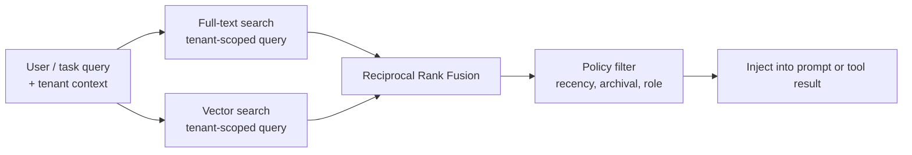

# Chapter 06 — Long-term recall

## TL;DR

Short-term memory (Ch.05) is what the model sees right now. Long-term recall is how anything useful from the current run survives until the next one — and how you find it again. There are three retrieval paradigms (semantic vector search, full-text search, curated knowledge), three places retrieval can hook into the loop (in the prefix as a frozen snapshot, in the volatile tail as a tool result, prefetched at session start), and one design constraint that ties them all together: whatever you put in the prefix must stay byte-stable across turns or you lose the cache from Ch.04. This chapter is about picking the right combination — not "add a vector DB," but the right context for this decision, retrieved through the right mechanism, injected in the right place.

---

## Why this matters

An agent without long-term memory re-learns the same project facts, user preferences, and prior failures every session. An agent with the wrong memory silently retrieves the wrong thing — a vector search that confidently returns a paraphrase when the user asked about a specific error code, a keyword search that misses everything that was rephrased between sessions. Both fail quietly, both teach the model wrong things, and both are easy to misdiagnose as *the model is bad*.

Retrieval that works is retrieval whose failure modes are visible. This chapter is about the three primary mechanisms, how they fail, and how to combine them so a single failure does not become a silent wrong answer.

---

## The concept

### What long-term memory actually is

Across production systems, "long-term memory" is usually four kinds of thing stacked on top of each other:

- **Plain markdown files** — `MEMORY.md`, `USER.md`, agent notes, skill files. Human-readable, human-editable, frozen at session start into the system prompt. Hermes Agent and OpenClaw both center on this shape.
- **Structured tables** — SQLite (`sessions`, `messages`, with FTS5 indexes), Postgres in larger systems. Append-only for the audit transcript; queryable for recall.
- **Vector indexes** — optional, layered on top via `sqlite-vec`, `pgvector`, or a dedicated store. Used for semantic similarity when keyword search is not enough.
- **External providers** — Honcho, Mem0, custom retrieval services, or MCP tools that wrap any of the above.

Markdown files alone can carry a small single-user agent — a personal assistant with one user, one machine, and a handful of notes works fine on files. Structured tables become load-bearing the moment you need to search across sessions, audit history, or scale beyond one user — which is most production paths. Vector indexes and external providers are layered on top; you can build a capable agent without them, and most paths do not need them on day one.

### Storage shapes, picked by access pattern

| Shape | Best for | Update | Retrieval |
|---|---|---|---|
| Markdown file | Identity, user model, project rules, skill content | Human or curator | Read whole file at session start |
| Structured table (+ FTS) | Audit log, session search, lookups by ID | Append-only | SQL query, full-text |
| Vector index | Semantic recall, paraphrase queries | Append + embed | k-nearest neighbors |
| External provider | Cross-product memory, large-scale knowledge | API push | API query |

The first column doubles as a question to ask before adding a layer: *what does my agent need to remember that the layers above don't already handle?* If the answer is nothing, you do not need that layer. Most production agents land at "markdown + SQLite+FTS" and only reach for vectors when paraphrase queries become common.

### Three retrieval paradigms

You pick from three primary techniques and combine them:

- **Vector search** embeds text and retrieves nearby vectors. Wins on paraphrases, similar past issues, conceptual questions. Loses on exact identifiers — ticket numbers, error codes, commit hashes, function names.
- **Full-text search** (BM25 or FTS5) indexes exact terms. Wins on IDs, code, file names, exact phrases. Loses on paraphrases and conceptual queries.
- **Curated knowledge** is a small set of maintained markdown pages. Wins when the knowledge set is bounded and worth hand-editing. Loses on scale — does not handle thousands of facts.

```ts
// All three paradigms implement the same shape — different stores behind it.
type Retriever = {
  search(query: string, opts: {
    tenantId: string;
    topK?: number;
    filters?: Record<string, unknown>;
  }): Promise<Array<{
    id: string;
    text: string;
    score: number;
    metadata: Record<string, unknown>;
  }>>;
};
```

A single `Retriever` interface lets you swap implementations or stack them.

The `tenantId` filter is not optional — retrieval is data access, and an agent that recalls one user's memory into another user's session is a security incident, not a bug. Enforce it at the storage layer (refuse queries without a tenant), not at the call site (where it is one easy bug away from being skipped).

### Hybrid retrieval, the default

For most agents, vector and full-text together outperform either alone. The standard merge is reciprocal rank fusion:



Tenant scoping is a *query-time* predicate, not a post-merge filter — the search itself refuses to return cross-tenant rows. Anything that filters after the merge (recency boost, archival rejection, role-based visibility) is policy, not access control. Mixing the two is the bug pattern: a tenant filter sitting downstream of retrieval has already had cross-tenant rows in memory, which is the same thing as a leak under most threat models.

```ts
// RRF: no training data, surfaces records that rank in multiple lists.
function rrf(rankedLists: Array<Array<{ id: string }>>, k = 60) {
  const scores = new Map<string, number>();
  for (const list of rankedLists) {
    list.forEach((r, idx) => {
      scores.set(r.id, (scores.get(r.id) ?? 0) + 1 / (k + idx + 1));
    });
  }
  return [...scores.entries()]
    .map(([id, score]) => ({ id, score }))
    .sort((a, b) => b.score - a.score);
}
```

RRF rewards records that show up in multiple lists while still letting one strong signal surface a result. It needs no training, just two ranked lists in the same shape. When wired in, run vector and FTS in parallel and feed both outputs into the fuser — it is one of the cheapest quality improvements in the whole memory stack.

### Ranking is not just similarity

Pure similarity scores often surface the wrong entry. A semantically perfect match from two years ago is usually less useful than a slightly weaker match from last week. Production systems lean on three extra signals when ranking results:

- **Recency.** A small linear or exponential decay applied to the base score. Yesterday's entry beats last year's at the same cosine similarity. Hermes Agent's session search summarizes results with recency weighted in; OpenClaw layers a recency boost on top of vector and FTS hits.
- **Confidence.** Entries tagged `user-confirmed` rank above `agent-inferred` at equal similarity. The tag comes from Ch.07's writing path, but the retrieval layer is where it earns its keep.
- **Access frequency.** An entry the agent has consulted thirty times this month is probably more useful than one nobody has touched. Tracking `last_accessed_at` and folding it in is cheap and effective.

A small reranker after RRF — recency + confidence + access frequency — often improves perceived quality more than swapping the underlying vector model. Ask your agent to wire one and to log the rank changes per query; the histogram tells you which signal is doing the work and which is dead weight.

The same reranker is also where you reject candidates outright. An entry whose access frequency is zero, whose confidence is `agent-inferred`, and whose age is over 90 days is almost always noise. Drop it before it reaches the prompt rather than letting the model judge it.

### Where retrieval lives in the loop

Retrieval is not a single hook point. Three placement choices, each with different trade-offs:

- **In the prefix, at session start (frozen).** Read once, baked into the system prompt, frozen for the session. Cache-warm, cheap on every subsequent turn. Used by `MEMORY.md`, `USER.md`, the skill index, project context. The constraint: whatever you inject here cannot change mid-session without breaking Ch.04's cache.
- **In the volatile tail, as a tool result.** The model decides at runtime to call a `search_memory` or `session_search` tool. The result comes back as a tool message. Live, query-time, no cache penalty (the result lives in the tail anyway). Best for queries that depend on what the conversation just discovered.
- **Prefetched at session start, injected into the first user message.** The harness queries external providers (Honcho, custom services) before the loop starts; the results enter the *tail* as a fenced block. Hermes Agent's `MemoryManager.prefetch_all()` is this shape. It is a compromise — fresh data without an extra tool call per turn, but it pays the cache miss on the first turn.

Most production agents use all three. The decision per piece of memory: *does this change inside the session? If no, prefix. If yes, tool result. If it's external and slow but needed up front, prefetch.*

### The skill-index pattern — progressive disclosure

The most common piece of memory in the prefix is a *skill index*: a list of `(skill_name, one-line description)` pairs that takes a few hundred tokens, regardless of how many skills exist. The full content of any skill is loaded on demand via a `skill_view(name)` tool.

This is progressive disclosure. The model sees the index every turn (cheap, cache-warm). It pays the cost of full content only when it actually decides to use a skill. Hermes Agent and OpenClaw both implement this with markdown files in `~/.hermes/skills/` or `~/.openclaw/skills/`; the YAML frontmatter (`name`, `description`, `version`, `platforms`) becomes the index entry.

```ts
// What the prompt sees at session start.
function buildSkillIndex(skills: SkillFile[]): string {
  return skills
    .filter(s => !s.archived)
    .map(s => `- ${s.name}: ${s.description}`)
    .join("\n");
}

// What the model invokes when it wants the full skill body.
const skillViewTool = {
  name: "skill_view",
  description: "Load the full content of a skill by name.",
  input_schema: {
    type: "object",
    properties: { name: { type: "string" } },
    required: ["name"]
  }
};
```

The pattern generalizes. Any memory store whose entries have short summaries can be exposed this way — wikis, FAQ databases, runbooks, project READMEs. Ch.14 goes deeper on skills as a design unit; this chapter is about the *retrieval pattern* they ride on.

### Memory namespaces

Memory is data, and data needs scope. Real systems separate it along four axes:

- **Per-user / per-tenant** — the most important boundary. Crossing it leaks data between customers.
- **Per-project / per-workspace** — coding agents are usually scoped to a project; a memory written while debugging Project A should not surface during work on Project B.
- **Per-agent role** — an explore agent and a build agent may share memory; an audit agent and a production agent should not.
- **Per-environment** — staging and production should never share memory. A test scenario in staging that wrote a misleading fact must not surface in a real production session.

The mechanics vary. Hermes Agent uses workspace-scoped MEMORY.md files. OpenCode resolves per-project state via `InstanceState`. Paperclip has explicit multi-tenancy via a `companies` table with row-level scoping on everything else. The shape that scales: every memory query takes a *tenant context* parameter, and the storage layer refuses to return entries without one. The "default" namespace is a security hole waiting to be exploited; do not ship one, even in development.

Beyond scope, memory has *lifecycle*: entries get deleted on user request, expired by TTL, soft-deleted by the curator pending review. The retrieval layer must honor these states at the query boundary — a soft-deleted entry returned from a vector index is the same kind of correctness bug as a tenant leak. Ch.07 covers the writing-side machinery (curator lifecycle, deletion markers, archival); Ch.18 covers consent, right-to-be-forgotten, retention policy, and the audit obligation. Ch.06's job is to refuse to return what those layers have marked as off-limits.

### Memory in the prompt: format and budget

How memory enters the prefix matters more than people expect. Common shapes:

- **Delimited markdown sections.** Hermes Agent and OpenClaw delimit MEMORY.md entries with the `§` (section sign) so the model can identify entry boundaries without relying on layout.
- **YAML frontmatter.** Skill files use `name`, `description`, `version` blocks the prompt builder can read mechanically.
- **Fenced blocks.** External memory query results are often injected as `<memory-context>...</memory-context>` fences; the agent UI can strip them from user-visible display while keeping them in the model's view.

The size budget is real. A 50-KB `MEMORY.md` shoved into the prefix every session is 50 KB of cache-warm payload — fine if it is genuinely load-bearing, expensive if it is mostly noise. Pick a soft cap (10–20 KB total memory in prefix is a reasonable starting point) and have the curator from Ch.07 enforce it. The agent will not feel the difference between "10 KB of focused notes" and "50 KB of accumulated detritus" except in latency and cost — and possibly in reasoning quality, because more noise in the prefix is more noise the model has to skim every turn.

### External memory providers

Anything beyond local files and SQLite is an external memory provider — Honcho, Mem0, a vector service from a cloud provider, your own retrieval API. The pattern across systems: providers register as plugins, get called from one of the three placement hooks above, and their results follow the same `Retriever` shape.

A useful discipline that Hermes Agent enforces explicitly: *one provider per recall purpose*. Mixing two providers for the same purpose tends to produce inconsistent, conflicting recall the model cannot adjudicate. If you need redundancy on a single purpose, run one as primary and the other as a shadow you compare against in logs, not as a parallel injection. Two providers serving genuinely *different* purposes — one for user preferences, one for an organizational knowledge base — is fine; the discipline is per-purpose, not blanket per-session.

Latency matters too. An external provider that adds 800 ms to session start is fine; one that adds 800 ms to *every turn* is not. The placement rule from earlier in the chapter answers this directly: slow providers belong in the prefetch path or the tool-call path, never as a per-turn synchronous lookup the model is waiting on.

### Embedding-model migration

Vector recall is tied to a specific embedding model, and that model will be replaced — a new version from the vendor, a switch to a cheaper or self-hosted embedder, an endpoint deprecation. When the embedding changes, every vector in your index is in the wrong space and recall quality silently drops.

The migration shape that works:

- **Stamp the embedding model on every record** (`model: "text-embedding-3-small@2024-01"`). You will not remember which model wrote which vectors otherwise, and a half-migrated index with mixed models gives nonsense scores.
- **Re-embed in the background; dual-write the new index.** Keep the old index serving queries until the new one is fully populated. A long migration is fine; a half-populated index serving live queries is not.
- **Switch the query path atomically.** Once the new index is validated against a held-out set of known-good queries, flip the read path. Keep the old index around for a recovery window in case the new model regresses on something the held-out set missed.

Plan for this on day one — at minimum, persist the model version alongside every embedding — so you do not discover the problem the day a deprecated endpoint goes dark. External providers (Honcho, Mem0, hosted vector stores) handle this internally, which is one of the better reasons to use them; if you run your own index, you own the migration.

### Retrieval as observability

A recall layer you do not measure is one whose silent failures you only discover when a user complains. Three measurements worth wiring from day one, parallel to the cache-hit and compaction signals from earlier chapters:

- **Empty-hand rate.** What fraction of retrievals returned zero results? If it is high, your store is sparse or your queries are wrong. If it is zero, you may be over-injecting noise.
- **Reach rate.** What fraction of *injected* memory entries did the model actually reference in its next turn? If the model never reaches for what you injected, your retrieval is delivering the wrong context. Hermes Agent and the leading coding agents both log `last_accessed_at` for this exact reason.
- **Tenant integrity.** A synthetic query in tenant A that should match an entry written only in tenant B should *never* return that entry. Run this as a continuous test in production, not just at deploy time.

These metrics belong in Ch.16's trace pipeline alongside the cache-hit-rate and compaction-method histograms from earlier chapters. Together they tell you whether the prefix and tail you so carefully designed are actually serving the model — or just spending tokens.

### Subagent recall boundaries

When a parent delegates to a subagent (Ch.10), recall is one of the boundary decisions. Three common policies:

- **Subagent inherits the parent's namespace.** The child sees the same memory and skill index. Cheap and consistent; risks pollution if subagents are short-lived experiments whose "lessons" should not become permanent recall.
- **Subagent gets a scoped slice.** The child sees only memory tagged for its role (`explore`, `build`, a specific skill family). OpenCode's per-agent tool sets generalize naturally to per-agent memory sets.
- **Subagent gets nothing.** The child receives only the prompt the parent handed it; everything else is invisible. Useful for one-off computation; risks the child redoing work the parent's memory could have skipped.

Pick per agent profile, not globally. The retrieval layer should accept an *agent identity* alongside the tenant — the same `Retriever` interface, with one more filter dimension.

### Stale indexes and session continuity

A memory index that is correct at session start can be stale by turn fifteen. A few cases worth watching for:

- **Skills the curator archived mid-session.** The index in the running prompt still mentions them; the file is gone. The agent calls `skill_view(name)` and gets "not found." Handle this gracefully in the tool, not by rebuilding the prefix.
- **Memory written this session.** It is on disk but invisible in the running prompt (frozen at session start). It becomes visible next session. The agent should not be told otherwise.
- **External provider updates between sessions.** New entries land. The next session start picks them up; the current one does not.

This is the inverse of the cache constraint: stability buys you cheap turns, and the cost is mild staleness. Most teams accept the trade and recover gracefully in the tool layer rather than fighting it.

### The cache constraint, restated

Everything in this chapter is shaped by one rule from Ch.04: anything you inject into the system prompt becomes part of the cached prefix, and the cache wants byte-stable bytes. The practical implications for memory:

- **Files in the prefix freeze at session start.** Mid-session writes are visible next session, not this one. Ch.07 covers the writing path; the freeze rule lives here because it constrains what you can put where.
- **External provider results in the prefix break the cache** if they change between sessions. Either accept the cache miss on session start (Hermes Agent does), or push those results into the tail as a tool result instead.
- **Skill indexes are stable until the file list changes.** If a curator from Ch.07 archives a skill mid-session, the change is invisible until the next session start. This is by design.

The recall layer and the prompt-builder layer are not separate concerns — they are the same concern, looked at from two angles. If you internalize one rule from these two chapters, make it this one.

---

## Real-system notes

- **Hermes Agent** is the strongest reference for layered memory: file-backed `MEMORY.md` and `USER.md`, SQLite+FTS5 session store, optional vector index via `sqlite-vec`, optional external provider via Honcho, all unified under a `MemoryManager` that prefetches before the loop and exposes a `session_search` tool for live queries.
- **OpenClaw** ships the same shape: `MEMORY.md` per workspace, JSONL session transcripts, an optional `active-memory` plugin for semantic search, with a deterministic file order so the cached prefix stays byte-stable across sessions.
- **OpenCode** centers on session storage and project-scoped state (`InstanceState`), with a hidden git snapshot repo tracking file changes per step that powers a revert UI. The lesson: long-term recall can be code state, not just text — files on disk and their commit history are also memory.
- **Paperclip** is the workflow-control-plane version of long-term memory: `issues`, `agents`, `runs`, `approvals`, `cost_events` — all durable, all queryable, all scoped per company. That is recall at the organizational-process level, with the same shape applied to a different domain.

---

## Common failure cases

*These failures are durable; their fixes evolve fastest — each names the pattern and leaves current specifics to you and your AI partner.*

- **Vector search always returns something.** k-NN can't return nothing, so the agent confidently cites the least-irrelevant noise when nothing actually matches. *Fix: a score floor plus a query-type router that sends identifiers to full-text search first.*
- **Bad chunking caps your recall ceiling.** The right document is in the store but the agent retrieves the wrong piece of it, or half of it. *Fix: semantic-boundary chunking with overlap, measured against a recall@k gold set rather than similarity scores.*
- **The index falls behind the source of truth.** Retrieval serves an entry that was edited or deleted minutes ago, or misses one just written. *Fix: treat the index as a fail-safe derived view re-validated against the canonical row, and alarm on its lag (Ch.08).*
- **A migration silently halves recall quality.** Nothing errors, but mixing two vector spaces makes answers vaguer the week you change the embedder. *Fix: eval-gated migration with a held-out query set as the gate, and refuse to compare results across embedding versions (Ch.16, Ch.17).*
- **A query without tenant scope leaks across customers.** A new code path queries the store without threading tenant context, disclosing one customer's memory in another's session. *Fix: fail-closed tenant scoping at the storage layer plus a continuous cross-tenant canary (Ch.18).*

---

## Pair with your agent

A few prompts that work well on this chapter:

- *"Build me a `Retriever` interface and three implementations: vector via sqlite-vec, full-text via FTS5, and a markdown wiki. Plug them into the same RRF combiner. Show me a query returning three ranked lists and the fused output."*
- *"Pick three concrete pieces of memory my agent needs (a user preference, an error code from last week, and a project rule). Tell me which retrieval method handles each, and where in the loop it should be injected — prefix, tool result, or prefetch."*
- *"Implement the skill-index pattern: the prompt builder reads YAML frontmatter from every skill file and produces a one-line-per-skill index. The model calls `skill_view(name)` to load full content. Show me both, then add the case where the file was archived mid-session."*
- *"Add tenant scoping to my retrieval layer. Write a test that proves a query in tenant A cannot return any entry written by tenant B, even under deliberately malformed input."*
- *"Profile the size of my system prompt's memory section across ten sessions. If it averages above 15 KB, propose what to move from the prefix into a tool-result-on-demand pattern, and estimate the cost difference."*
- *"Walk me through Hermes Agent's `MemoryManager.prefetch_all()`. Then implement the equivalent for my stack: an external provider query at session start whose results are injected as a fenced block into the first user message."*
- *"Set up A/B logging: vector-only vs FTS-only vs hybrid (RRF) for the same set of queries. Run my last week of sessions through all three and report which strategy retrieves the right thing most often, by query type."*
- *"Add retrieval observability: empty-hand rate, reach rate (did the model actually use what I injected?), and tenant integrity tests. Plot all three per day and tell me which one is regressing."*
- *"Add a reranker to my hybrid pipeline that boosts recency and user-confirmed entries on top of the RRF score. Log the rank shifts and tell me whether the reranker is doing real work or just shuffling tied scores."*

---

## What's next

You now know where memory lives, how to retrieve it, how to rank what comes back, and how it fits the cache discipline from Ch.04.

The harder problem is what to write into memory in the first place — and how to keep it from rotting. Ch.07 covers writing modes, the safety filter at the memory boundary, atomic writes and concurrent-writer contention, conflict resolution, the curator lifecycle that keeps memory pruned, and how subagents are and are not allowed to write back.
