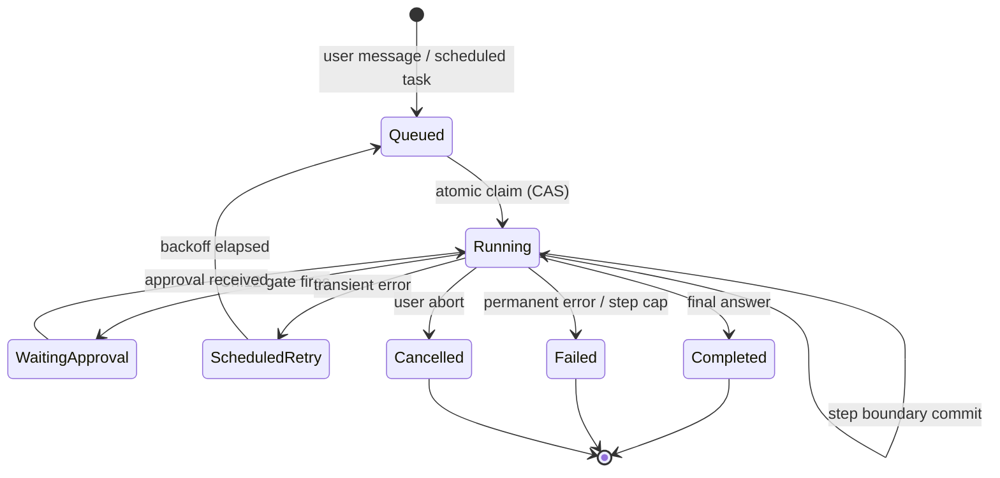
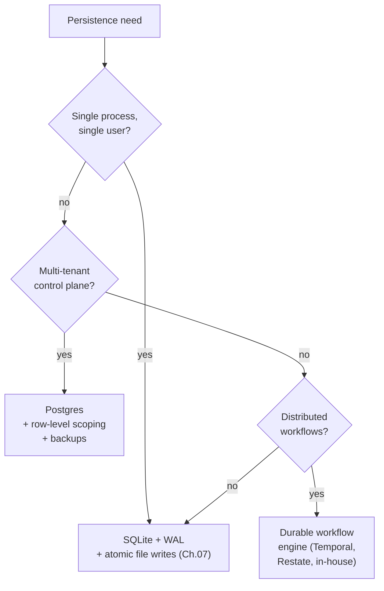

# Chapter 08 — State and persistence

## TL;DR

A long-running agent should survive a process restart, a node failure, or a deploy mid-loop — without redoing the expensive work it already did, and without doing destructive work twice. This chapter is about durable execution: what counts as state at runtime (message array, in-flight tool calls, abort token, credentials, prompt fingerprint), where the step-boundary commit lives, how a run state machine and compare-and-swap claim coordinate multiple processes, what heartbeats and orphan reapers do for hung work, how to choose between SQLite, Postgres, and a durable workflow engine, and the difference between crash recovery, resume, and a user clicking a button labeled "Resume."

---

## Why this matters

A coding agent has been running for forty minutes. It has read fifty files, made twelve edits, generated three pull-request descriptions. The deploy goes out. The process restarts. The agent loses the abort token in memory but the checkpoint says it was on step 23. On replay you discover the agent re-sends one of the pull-request descriptions, because the tool that posts the description was not idempotent and the harness retried it. Your team's GitHub now has a duplicate PR. The model is fine. The agent's code is fine. The persistence layer leaked.

This is the class of failure that does not show up in development — it shows up the first time you do a real deploy under load. The cost is paid in either reliability or in the careful work that this chapter is about.

---

## The concept

### What "durable" actually means for an agent

Not all runtime state is the same. A useful inventory before any code is written:

- **The message array** — every model turn, every tool call, every tool result. Append-only, durable, the source of truth for replay. (This is the audit log from Ch.05, viewed from the runtime angle.)
- **Tool execution status** — for each tool call: pending, running, completed, failed. Lives next to the message in OpenCode's `ToolPart.status`, in Paperclip's `heartbeat_runs.status`, in Hermes Agent's inline result.
- **In-flight side effects** — the writes, sends, payments that *started* but have not returned. The hardest piece of state to recover; the easiest to misjudge.
- **Working memory** — the small mutable scratchpad from Ch.05. Must be durable across crashes because rebuilding it from the transcript may not exactly reproduce it.
- **The abort token** — a process-local signal. *Does not survive restart.* If runaway runs are only stopped via the abort token, a crash leaves them running.
- **Auth profile and credentials** — must reload at startup or be reconstructable from a credential pool. Hermes Agent stores them under `~/.hermes/agents/<id>/auth-profiles.json`; Paperclip stores encrypted rows in Postgres behind a master-key file.
- **The prompt fingerprint** — the SHA from Ch.04. Must round-trip through the store so the rebuilt system prompt is byte-identical and the cache survives the restart.
- **Cost and token ledger** — running totals for budget caps (Ch.17). Hermes Agent recomputes from the message log on resume; Paperclip persists separately in a `cost_events` table for auditability. If budgets must be enforced *across* restarts, the ledger needs its own durability — recomputing from the log is fine until the log is partially compacted, then it isn't.

A durable runtime is one where each item above has an explicit policy: persist before commit, persist after commit, reconstruct on resume, or accept the loss. There are no "default" answers; pick per item, write it down, and have your agent generate the persistence code from the list.

### The step boundary as the commit point

A step is one full loop iteration: model call → any tool dispatches → reflect. The commit point lives between Reflect and Stop — the same boundary Ch.02 identified as the place where everything attaches. After a step completes, three things should be on disk before the loop yields:

- The new message(s) appended to the audit log.
- Tool execution status transitioned to its terminal value.
- Working memory and any cost/usage counters updated.

OpenCode flushes after every `LLM.stream()` cycle; Hermes Agent does the same in `_flush_messages_to_session_db`-shaped writes; Paperclip commits per `heartbeat_run_events` row. The pattern is universal: write before yielding control. A step that returns to the caller before its writes are durable is a step that can be lost.

```ts
// What a step-boundary commit holds.
type Checkpoint = {
  sessionId:           string;
  stepIndex:           number;
  status:              "running" | "waiting_for_approval"
                     | "completed" | "failed";
  messageRange:        [number, number];   // appended on this step
  workingMemory:       WorkingMemory;
  tokensSpent:         number;
  costSpent:           number;
  promptFingerprint:   string;             // Ch.04
  lastError?:          string;
  committedAt:         string;
};
```

Do not write secrets into the checkpoint — store secret *references* and resolve them at runtime. Do not write retry counters into the message log — they belong on the checkpoint, where they update.

### The run state machine

A run is the unit of work between a user message (or scheduled trigger) and its terminal answer. Every production system models this with an explicit state machine. Implicit transitions are the source of half the duplicated-side-effects bugs in agentic systems.



Paperclip codes this almost exactly — `heartbeat_runs.status IN (queued, running, completed, failed, cancelled, scheduled_retry)`. The rules:

- Every transition that depends on the current state needs a conditional update — `UPDATE ... WHERE status = <expected>` is the minimum. The canonical race is `queued → running` (two workers fighting for the same row), and the next subsection walks the pattern in detail, but the same `WHERE` clause guards approvals (`running → waiting_approval`), aborts (`running → cancelled`), retry transitions, and terminal writes against concurrent overwrites. A transition based on a state that changed underneath you is a lost update — same bug, different label.
- `running → terminal` is *idempotent once won*: a duplicate commit setting the same terminal status on an already-terminal row is a no-op, which is the intended behavior on a replay or retry.
- Terminal states never transition back. A `failed` run that needs to retry produces a *new* run with a `parent_run_id` linking back — never an in-place revival.

Most agent bugs at this layer are state-machine bugs: an implicit transition that lets the same work happen twice, or a missing transition that leaves a run stuck.

### Crash recovery vs resume vs the "Resume button"

These three sound similar and behave very differently.

- **Crash recovery** is *same intent, new process body*. The deploy restarted; the user expects work to continue. The system prompt is unchanged; the cache *may* be hot if the prefix was round-tripped byte-identically through disk *and* the provider's TTL has not elapsed *and* you are routing to the same model and region (cache is per-provider, per-model, often per-region — Ch.04 has the details). In-flight tool calls need careful triage.
- **Resume** is *same session, later in time*. The user closed the tab and came back hours later. The cache may have expired (Ch.04 TTL). The system prompt may have been edited between visits. The audit log replays cleanly but the world may have moved on.
- **The "Resume button"** is an *explicit user action* to continue a session that paused. The user knows there was a gap; the system has more freedom to ask for confirmation, surface what happened, and reset working memory if appropriate.

Conflating these produces subtle bugs. Crash recovery should be silent and aggressive *for work that is safe to replay* — read-only operations, tools marked `idempotent: true` (Ch.03), and outbox-backed side effects. Anything else routes through the in-flight triage in the next subsection, with non-replayable tool calls surfaced to the user rather than retried silently. Resume should preserve the cache where possible and accept the cost where not. The Resume button should *show* the user where they are and what is about to re-run.

### In-flight tool calls during a crash

The hardest case in this whole chapter. A tool call started; the result never came back; the process died. On restart, four options exist, in order of preference:

1. **The tool is metadata-tagged `idempotent: true` (Ch.03).** Replay it. The second call returns the same result.
2. **The tool has an external idempotency key.** Replay it with the same key; the downstream system de-duplicates.
3. **The tool wrote to a durable outbox before executing.** Replay reads the outbox; if the intent is marked fulfilled, skip; otherwise retry with the same key.
4. **The tool is not safe to replay.** Mark the run failed, surface to the user. Better an embarrassed *"did this happen?"* than a duplicate email.

The metadata flags from Ch.03 are what let the harness pick the right option without thinking. Tools without those flags default to (4): fail loud, ask the user, never silently retry. The reverse — defaulting to retry — is how duplicate PRs happen.

### Atomic claim with compare-and-swap

Anything that runs across multiple processes — a heartbeat scheduler picking up queued work, two API servers racing on the same session — needs an atomic claim. The pattern across databases is the same: compare-and-swap on a status column.

```sql
-- Claim a queued run atomically. Returns the row only if you won the race.
UPDATE runs
   SET status      = 'running',
       claimed_by  = :worker_id,
       claimed_at  = now()
 WHERE id     = :run_id
   AND status = 'queued'
RETURNING *;
```

If the `UPDATE` affects zero rows, another worker claimed it first; move on. If it affects one row, you own the work until you transition it to a terminal state or your lease times out. Paperclip uses this shape on `heartbeat_runs`; in Postgres-flavored stacks `SELECT ... FOR UPDATE` inside a transaction is equivalent; in SQLite with WAL the same `UPDATE ... WHERE status=...` works because the writer is serialized.

For single-process systems (Hermes Agent in single-user mode, an OpenCode dev server) CAS is overkill. For anything that *might* scale horizontally later, wire it from day one — the cost is one column and a `WHERE` clause; the cost of retrofitting it is much higher.

### Heartbeats and orphan recovery

A claim without a heartbeat is a slow leak — the worker dies, the run stays "running," nothing else picks it up. Production systems pair the claim with two more columns:

- **`last_heartbeat_at`** — the worker updates this every few seconds while the run is alive.
- **`lease_expires_at`** — when no heartbeat is seen past this, the run is presumed orphaned.

A reaper service periodically scans for runs whose `lease_expires_at < now()` and either re-queues them (`status → queued`, fresh attempt) or fails them after a retry count is exhausted. Paperclip's `reapOrphanedRuns()` is exactly this; it also confirms the OS PID is dead before clearing the lease, to handle the case where the heartbeat is just slow rather than gone.

Two tuning constants are honest trade-offs:

- **Heartbeat interval.** Shorter is faster orphan detection but more write traffic. Paperclip writes every few seconds.
- **Lease timeout.** Longer tolerates a slow tool (a 30-minute compilation); shorter recovers faster. Paperclip defaults to six hours and lets adapters tune it per workload.

A reaper is not a luxury for distributed agents. It is the only thing that prevents a single crashed worker from leaving work permanently stuck.

The reaper itself also needs liveness. Run it as its own job with its own heartbeat, or every other worker can race to be the reaper at startup. Paperclip elects a single reaper via the same CAS pattern used for runs — one row in a small `service_locks` table, claimed and refreshed.

### Append-only event log vs per-step snapshot

Two persistence shapes appear across systems, often combined:

- **Append-only event log.** Every step writes new rows; the current state is computed by reading them all in order. Hermes Agent's `messages` table is this; Paperclip's `heartbeat_run_events` is this; OpenCode's `PartTable` is mostly this.
- **Per-step snapshot.** Every step writes the *whole* state object, overwriting the previous one. Faster to resume (no replay needed); larger on disk; harder to audit because intermediate values are lost.

Most production agents do append-only for the audit log (because Ch.05 needs the full transcript anyway) and per-step snapshot for the working memory and checkpoint metadata (because those need fast random access and a small footprint). The combination is cheap to operate and gives you both the audit story and the resume story without duplicating either.

### Choosing the store



SQLite carries an enormous amount of production weight. Hermes Agent and OpenCode are both SQLite-backed and run real workloads. The reason: WAL mode gives you concurrent readers and a single writer without configuring anything, `fsync` makes it durable, and the file is just a file — easy to copy, easy to back up, easy to inspect with a CLI.

Move beyond SQLite when *multiple processes* must coordinate writes, when you need *multi-tenant* row scoping enforced by the database, or when you need a *scheduler* that wakes up delayed jobs across nodes. Paperclip's choice of Postgres is exactly this: it is a control plane that needs all three. A durable workflow engine (Temporal, Restate, an in-house equivalent) is the step above that — useful when the agent's own logic is best expressed as a workflow with arbitrary side-effecting steps that must be replay-safe.

WAL mode is not free. It adds a `-wal` and `-shm` file alongside the `.db`, roughly doubling disk during heavy write phases. For mobile or edge agents, plain journal mode may be the right call. Hermes Agent's `apply_wal_with_fallback` handles the case where WAL is unavailable (NFS, SMB) and gracefully falls back to `journal_mode=DELETE`.

### Idempotency at the step boundary, not just the tool

Ch.03 covered tool-level idempotency keys. Step-level idempotency is a different guarantee: *the same step, replayed, must produce the same observable effect.*

```ts
function stepIdempotencyKey(c: {
  sessionId: string; stepIndex: number; action: string;
}) {
  return sha256(`${c.sessionId}:${c.stepIndex}:${c.action}`).slice(0, 32);
}
```

Two patterns sit on top of this:

- **The outbox pattern.** Before issuing a side effect, write the *intent* (and its idempotency key) to a durable table. After the side effect succeeds, mark the intent fulfilled. On replay, the harness reads the table first: fulfilled intents are skipped; unfulfilled ones retry with the same key. This decouples the durability of the *decision* from the durability of the *delivery*.
- **The fulfillment marker.** A simpler version for non-distributed systems: a `step_complete` boolean on the checkpoint. Once set, the step never re-runs, even if some sub-action inside it never returned a value. The honest limit: the marker tells you about *your own* commit, not the world's. If a side effect crossed a network and the process died between the call landing and the marker being persisted, recovery cannot know which happened. Blind skip risks losing work; blind retry risks doing it twice. The right move is *reconciliation* — ask the downstream system whether the call landed — and that is precisely what the outbox pattern is for, which is why the fulfillment marker stops being enough the moment a side effect leaves your process.

Most production agents use the second; the outbox pattern appears when side effects cross a network boundary you cannot fully trust (third-party APIs, message queues, downstream services that themselves crash).

### The compaction chain meets resume

Ch.05 introduced session rotation: when compaction is no longer enough, a new session is created with `parent_session_id` linking back to the old one. From the persistence angle, this is also a *resume primitive*. A failed long-running session can be replaced by a new session that starts with a handoff block summarizing the parent's state; the audit log still traces all the way back, and the cache for the new session warms freshly without dragging the old one's bloat.

The corollary: never delete a parent session because its child resumed it. Archive it, mark it superseded, but the chain has to stay intact. Resume, audit, and rollback all depend on it. Ch.07's "never prune the audit log" rule applies here too — different angle, same discipline.

### Operating the store: backup, restore, migration

State that is not backed up is state that will be lost. The patterns:

- **Backup.** Paperclip ships periodic `pg_dump` with a configurable retention window. SQLite-backed systems should run a `VACUUM INTO` snapshot on a schedule and copy the file out. The minimum is a daily full snapshot; better is an incremental WAL backup. Anything below "daily" is a story you will tell after the incident.
- **Restore.** Always restore a *consistent* snapshot — never restore selective rows from a backup into a live store unless you can prove they do not violate the state machine. Restore must also honor Ch.07's deletion markers — content removed under user request or retention policy stays removed when an old snapshot is brought back, or you have just resurrected data you committed to delete. Restore is rare; rehearse it before you need it, ideally as part of your deploy checklist.
- **Schema migration.** Schemas change between deploys. OpenCode and Paperclip use Drizzle migrations; Hermes Agent versions the schema explicitly with a `schema_version` row. The forward path is well-trodden; the *backward* path almost never is. Default to additive migrations (new columns with defaults) and reserve destructive migrations for explicit data-cleanup deploys.
- **In-flight runs across a migration.** A checkpoint written under schema v3 may not deserialize cleanly under v4 if v4 dropped or renamed a column. Stamp every checkpoint with the schema version that wrote it (`checkpointSchemaVersion: 3`). Make the resume path version-aware — apply per-version coercions to bring the checkpoint forward, and fail loud when the coercion is impossible rather than silently producing a corrupted run. For destructive migrations, *drain* in-flight runs first: stop the queue, wait for active runs to terminate or be cancelled, then migrate. Five minutes of paused throughput beats three days of debugging a half-migrated checkpoint.

### What a "Resume button" actually requires

If you ship a button labeled *"Resume,"* the user is expecting more than crash recovery. They are expecting an honest answer to *where am I, and what is about to happen?* Concretely:

- The session must be loadable from disk in full — audit log, checkpoint, working memory, cost ledger, all the way through.
- The system prompt must rebuild byte-identically, or the user must be told the cache will pay the rebuild cost (Ch.04).
- Any in-flight tool calls from the previous attempt must be classified (idempotent / outbox / unsafe) and surfaced before the loop continues.
- The user should be able to see *what the agent did last* and *what it was about to do* — the last completed step and the next planned action.

This is the system Ch.05, Ch.06, Ch.07, and Ch.08 make possible *together*. Memory survives in the right places, the audit log replays in the right order, the cache stays warm where it can, and the user sees a coherent picture instead of *"your agent crashed; click here."* The Resume button is the surface; everything underneath it is what this chapter is about.

---

## Real-system notes

- **OpenCode** is the strongest reference for embedded durability in a coding-agent setting: SQLite + WAL with Drizzle migrations, append-only `SessionTable` / `PartTable` / `SyncEvent`, a hidden git snapshot repo powering revert, and a per-session abort controller that does *not* survive restart (deliberately — interrupts are runtime-only).
- **Paperclip** is the reference for distributed durability at the control-plane level: Postgres with `SELECT ... FOR UPDATE` for atomic claim, a `heartbeat_runs` state machine with explicit transitions, the `reapOrphanedRuns` reaper that confirms OS PID liveness before clearing leases, multi-tenant scoping on every table, scheduled `pg_dump` backups with retention, and adapter-process isolation so a parent crash leaves the child running.
- **Hermes Agent** is the reference for the cache–resume duality from Ch.04 applied here: `SessionDB.sessions.system_prompt` persists the byte-identical prompt so an evicted-then-restored agent replays a warm cache, `apply_wal_with_fallback` handles WAL-unfriendly filesystems, and the cron scheduler's file-based lock shows the simplest possible advisory-lock pattern.
- **OpenClaw** stores per-session JSONL transcripts plus credential and memory state, illustrating a file-based persistence model that scales for single-user multi-channel use without a database. Good reminder that "durable" does not require a DB if the workload fits.

---

## Common failure cases

*These failures are durable; their fixes evolve fastest — each names the pattern and leaves current specifics to you and your AI partner.*

- **A restart re-runs work that already happened.** After a crash or deploy the agent re-sends an email, re-posts a PR, or re-charges a card. *Fix: invert the default so an in-flight call with no replay-safety signal fails loud and asks rather than silently retrying (Ch.03).*
- **The checkpoint and the work disagree.** Disk says the step finished but the side effect never happened, or it happened but disk forgot. *Fix: the outbox pattern — write the intent before doing the work and reconcile against the downstream system on resume.*
- **The cache is stone-cold on every deploy.** Resume is correct but the first turn back costs many times what it should. *Fix: persist the byte-identical prefix and its prompt fingerprint, rebuild from stored bytes on resume, and pin model/region where you can (Ch.04).*
- **Crashed workers leave runs stuck, or get reaped mid-flight.** Runs marked "running" that no process touches, or a healthy long run killed out from under itself. *Fix: tune the lease against real p99 step duration and make the reaper confirm PID liveness before clearing a lease.*
- **Resume gets slower every week.** Restoring a session that took a second now takes ten and the checkpoint file is enormous. *Fix: keep the per-step snapshot small and bounded, storing a messageRange pointer into the append-only log instead of copying the transcript.*

---

## Pair with your agent

A few prompts that work well on this chapter:

- *"Inventory my runtime state piece by piece — message array, tool status, in-flight side effects, working memory, abort token, credentials, prompt fingerprint. For each one, tell me whether my current store persists it, and propose a fix where it does not."*
- *"Implement the run state machine from this chapter with an explicit `status` column and CAS claim. Write a stress test that races two workers on the same queued run and verifies exactly one of them wins."*
- *"Add heartbeats and an orphan reaper to my runs. The reaper should confirm OS PID liveness before clearing a stuck lease. Tune the heartbeat interval and lease timeout for my workload and explain the trade-off in three bullets."*
- *"Classify all my tools by Ch.03's `idempotent` flag. Then write the resume-after-crash logic that uses the flag to decide replay vs skip-and-ask. Test it with a deliberately-injected crash mid-tool."*
- *"Wire the outbox pattern for one specific external side effect (sending a Slack message). Write the intent, send, mark fulfilled. Inject a crash between each pair and verify the result on resume."*
- *"Profile my checkpoint payload across ten real sessions. If it averages above 50 KB, propose what should move from per-step snapshot to append-only log."*
- *"Implement crash recovery vs resume vs the Resume button as three distinct code paths. Show me which one fires for each of: process restart after deploy, user returning after 24 hours, user clicking Resume on a failed run."*
- *"Write the restore rehearsal: stop my service, restore yesterday's snapshot, start back up, prove the state machine is consistent. Time it end-to-end so I know how long an incident would actually take."*

---

## What's next

You now have a runtime that survives restarts, coordinates work across processes, and resumes cleanly without doing destructive work twice.

The next layer up is *planning* — how an agent decides what to do across many steps *before* executing them. Ch.09 covers the four planning shapes (no plan, checklist, plan-execute-replan, dependency graph), when each one helps, when it hurts, and the failure modes hidden in the easiest choices.
