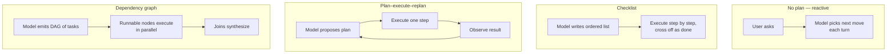
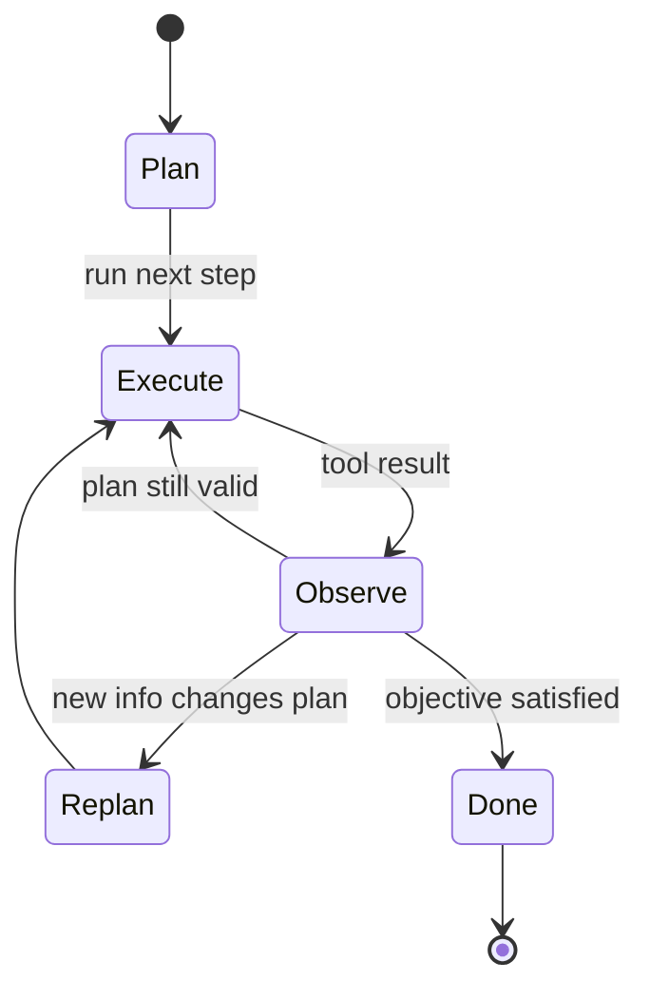

# Chapter 09 — Planning patterns

## TL;DR

Some tasks the model can answer in one move; some need three; some need thirty. Planning is the layer that decides which kind of task you have and how to structure the agent's path through it. This chapter covers the four planning shapes that appear in production (no plan, checklist, plan-execute-replan, dependency graph), the design decisions that pick between them (implicit vs explicit, plan-only vs build, who edits the plan), the replan triggers that catch a stale plan before the agent commits to it, and the failure modes hidden in each shape. The aim: pick the simplest planning pattern that fits the task — and recognize when the task is asking for the next one up.

---

## Why this matters

Without a plan, an agent thrashes — it reads the same files twice, takes a wrong turn at step 4 and never notices, calls a tool to do work the previous tool already did. With *too much* plan, the same agent spends half its tokens proposing a 20-step blueprint that becomes useless the moment the first tool result contradicts it. The cost shows up in tokens, latency, and (worst) in confident final answers that solved the wrong problem.

The fix is not "always plan more." It is matching the planning shape to the task and knowing when to replan. The rest of this chapter is the four shapes and the rules around them.

---

## The concept

### Four shapes, side by side

A useful mental map before we dig in:



You can usually tell which shape a task needs by asking two questions: *how well-defined is the goal?* and *how likely is it that step 1's result changes step 2's plan?* High-definition, low-divergence tasks fit the first two shapes; the last two are for tasks where the path is genuinely uncertain or has independent branches.

### Shape 1 — no plan

The agent picks one tool, runs it, and either answers or picks the next tool. This is the default for short Q&A, one-off lookups, simple transformations. OpenClaw's reactive flow and most leading commercial agents in chat mode use this when the task signature is small enough — *"what version of node is installed?"* does not need a plan.

Fast, cheap, fluid. Easy to thrash on anything genuinely multi-step.

### Shape 2 — checklist

The model writes a short ordered list before acting and checks items off as it goes. OpenCode's `TodoWriteTool` is the clearest reference: the model maintains a markdown checklist in working memory; the prompt builder injects the current list every turn. Hermes Agent achieves a similar effect with skill-shaped task notes.

```ts
// What the checklist tool returns. The list is what the model reads next turn.
type ChecklistPlan = {
  objective: string;
  steps: Array<{
    id:     string;
    text:   string;
    status: "pending" | "in_progress" | "done" | "skipped";
  }>;
};
```

Good for: 3–8 ordered steps where the model can reasonably hold the whole plan in its head but progress tracking helps. The list is the memory; the model self-corrects against it.

### Shape 3 — plan-execute-replan

The model proposes a plan, executes one or more steps, observes results, then *re-proposes* the plan if results change the picture. Most leading commercial agents in interactive mode work this way for non-trivial tasks; Paperclip's `plan_only` execution mode is the dedicated "plan now, execute later" half of this pattern.



Good for: investigation, debugging, research — anything where you do not know what step 5 looks like until step 3 finishes. The cost is an extra model call at every replan event; the win is that the agent is not committed to a stale plan.

### Shape 4 — dependency graph

For tasks with independent branches (review three files in parallel; fetch from three sources and merge), express the plan as a directed graph and execute runnable nodes in parallel. In practice this shape lives one level above pure planning, in delegation (Ch.10) — the runnable nodes usually become subagent calls.

```ts
// Runnable = pending + all deps complete. Trivial scheduler.
function runnableNodes(nodes: PlanNode[]) {
  const done = new Set(
    nodes.filter(n => n.status === "done").map(n => n.id)
  );
  return nodes.filter(n =>
    n.status === "pending" && n.dependsOn.every(id => done.has(id))
  );
}
```

Good for: workflows with explicit parallelism and join points. Bad for: anything that looks linear, where the graph is just complexity for its own sake.

### Choosing a shape

| Task shape | Planning shape |
|---|---|
| One obvious action | No plan |
| 3–8 ordered steps | Checklist |
| Uncertain path; results change next step | Plan-execute-replan |
| Independent branches with joins | Dependency graph |

Two anti-patterns to watch for: reaching for the dependency graph because it looks sophisticated when a checklist would do, and staying in "no plan" mode for a task that visibly needs structure. The model will go along with both — your design has to push back.

### Plan as memory, not as text floating in a message

A plan is just text — but where you keep it matters. Three places it can live:

- **In a tool result.** The model called `todo_write`; the result is the new list; the list shows up in the volatile tail like any other tool result.
- **In working memory** (Ch.05's mutable scratchpad). The list is part of `WorkingMemory.currentPlan` and the prompt builder renders it every turn.
- **In a separate file the user can edit** (`plan.md`, OpenCode's `plan.ts` flow). The agent and user share the artifact; either can revise.

Keep the plan in the same place across turns so the model knows where to look. Don't sometimes write it to a file and sometimes return it in a tool result; pick one. Hermes Agent keeps task plans in skill files; OpenCode keeps them in the todo tool; leading commercial agents tend to keep them in working memory rendered fresh into the prompt every turn.

### Plan-only agents vs build agents

A useful separation real production systems make: the agent that *plans* runs with a different tool set than the agent that *builds*. OpenCode registers separate `plan` and `build` agent profiles; Paperclip routes issues to either a planner or a builder via the `planning_mode_directive`. The shape:

- **Plan-only agent.** Read-only tools, no edits, no shell, output is a structured plan. A cheap model is often enough.
- **Build agent.** Full tool access including writes, edits, shell. The expensive model lives here.

The handoff: the planner's plan is approved (by the user or by a policy), then the build agent runs with the plan as its starting context. When planner and builder are different agents, this is Ch.10 territory; in single-agent setups, the same agent switches modes between turns.

### Implicit vs explicit plans

Some agents never write a plan — they just keep choosing the next tool. Others write a plan as their first action. Implicit is faster on small tasks; explicit catches the brittle-assumption failure mode early. A useful default: *if the task description names two or more deliverables, require an explicit plan; otherwise let the model decide per turn.*

The cheapest nudge in this direction: include the phrase *"start by writing your plan"* in the system prompt for tasks that look multi-step. The model usually complies, and the plan it writes is itself a useful signal — if the model cannot articulate a plan, the task is under-specified.

### When to replan

Four signals that mean "the plan is no longer valid":

- **New information** — a tool result that contradicts the plan's assumption.
- **Failed step** — a step that errored or returned unexpected output. Watch for the doom-loop signature from Ch.02: the same step failing the same way three times means replan, not retry.
- **Scope creep** — the user added a new requirement; the existing plan does not cover it.
- **Stale assumption** — the plan was written assuming the file is at `path/A`; it is now at `path/B`. The hardest to detect: the agent must explicitly *check* the assumption, not just assume it still holds.

```ts
// Cheap defense: check preconditions before each step.
async function preconditionsHold(step: PlanStep, ctx: AgentContext) {
  for (const check of step.preconditions ?? []) {
    if (!(await check(ctx))) return false;
  }
  return true;
}
```

The replan itself is not free — it costs a model call. Replan eagerly when the cost of being wrong is high (touching production data); lazily when the cost is low (a research summary).

### Plans are state

Plans live in working memory (Ch.05) and check-point with the rest of the runtime state (Ch.08). After a crash, the resume should pick up the plan and the completed-steps list — *not* invent a new plan and re-execute completed steps. This is how Ch.08's step-boundary commit prevents the planning layer from double-executing.

```ts
type PlanningCheckpoint = {
  goal:              string;
  plan:              ChecklistPlan | { nodes: PlanNode[] };
  completedStepIds:  string[];
  lastReplanReason?: string;
  lastReplanAt?:     string;
};
```

When you wire persistence, include the plan in the checkpoint. When you wire resume, load it *before* the first model call so the model knows it is mid-task.

### Inspect-and-pick vs plan-upfront

A useful framing for the ambiguity between "no plan" and "plan-execute-replan": at each step, the agent can either *inspect* the current state and pick the next move (reactive), or *commit* to a planned next move (declarative). They are not exclusive — most production agents are hybrids.

- **Inspect-and-pick.** Low latency, fluid, good for exploration. The trade-off: the model can lose track of the high-level goal and chase local optima.
- **Plan-upfront.** Higher latency to start (the plan costs a model call), but the agent is anchored to the goal; downstream steps inherit the framing. The trade-off: rigidity when the world changes underneath the plan.

The hybrid that wins most often: plan upfront enough to establish the *shape* of the work (three to seven steps), then inspect-and-pick within each step. The plan is the scaffolding; the per-step decisions fill it in.

### Plan abstraction level

A 50-step plan is a specification, not a plan. A one-step plan is no plan at all. The right granularity sits between two anti-shapes:

- **Too detailed.** Forty-seven steps. The first one fails and the entire plan is invalid; maintenance cost dominates.
- **Too vague.** *"Fix the bug."* Provides no structure the agent can execute against.

A useful rule: **each plan step should map to one or two tool calls.** If a step requires the agent to think for a paragraph before acting, decompose it. If a step is *"call tool X with args Y,"* it is implementation, not a plan — let the model derive it. Most production agents converge on 5–12 steps for moderately complex tasks.

A concrete contrast on the same task (a login regression):

| Granularity | Example step |
|---|---|
| Too vague | *"Fix the login bug."* — no resource named, no outcome. The agent has nowhere to start. |
| Too detailed | *"Call `read_file({path: 'src/auth.ts'})`; locate line 42; call `write_file(...)` to change `userId` to `user.id`; call `run_shell({cmd: 'npm test'})`."* — implementation, not a plan; the first failure invalidates everything below it. |
| Inspectable milestone | *"Reproduce the failing login flow against the dev server; trace the 500 to the offending field in `src/auth.ts`; fix the field reference; rerun the auth unit and integration tests."* — each step names an outcome and a resource; the agent picks the tools. |

The middle row is what the model is allowed to *do at runtime*, not what the plan is *for*. The bottom row is the plan: the agent has enough structure to act, and you have enough structure to inspect mid-flight without reading the code.

### Plan revision UX

If the user can edit the plan mid-stream, you get a much better feedback loop — and one of the cheapest ways to keep the agent honest. The pattern:

- The plan lives in a place the user can see (a file, a UI panel, a chat message).
- The agent re-reads the plan at the top of every turn.
- An edit by the user is visible to the next turn and may trigger a replan.

OpenCode's `plan.md` files are user-editable. Leading commercial agents typically render the plan in the UI and accept inline edits. This is mostly absent from systems where the plan only lives in the model's working memory — a missed opportunity. If you can give the user a handle on the plan, do.

### Planning is also observability

Parallel to the cache, compaction, retrieval, and memory metrics from earlier chapters, three planning measurements are worth logging from day one:

- **Replan rate** — fraction of steps that triggered a replan. Too high (>30%) means the plan abstraction is wrong; too low (<5%) usually means the agent is ignoring fresh information that should have triggered one.
- **Plan vs. execution divergence** — at session end, compare the originally proposed plan with what actually happened. Large divergence is a signal that the planner is producing low-value plans the executor ignores; small divergence with bad outcomes means the plan was wrong upfront.
- **Time-to-first-action** — how long after the user message before the agent calls its first tool. If the planner consistently spends two model calls before doing anything, you may be over-planning small tasks; if it never plans, you may be under-planning big ones.

These metrics belong in Ch.16's trace pipeline alongside the metrics from earlier chapters. Together they tell you whether your planning shape matches your traffic — or whether one team is reaching for a graph when a checklist would have been enough.

### Failure modes

| Failure | Symptom | Fix |
|---|---|---|
| Over-planning | Model spends turns refining the plan, never executes | Cap planning turns; require execution after N |
| Under-planning | Drift; agent solves the wrong sub-problem | Require explicit plan if task looks multi-step |
| Plan too detailed | One failure invalidates the whole plan | Decompose to 1–2 tool calls per step |
| Plan too vague | Agent cannot act on it | Reject plans whose steps don't name a concrete outcome and resource — *what* changes and *where*, not which tool to call |
| Stale plan | Plan was written assuming X; X is now false | Add precondition checks before each step |
| Plan never re-read | Model executes by memory, ignores edits | Render the plan into the prompt every turn |

Each is a single small thing to defend against; together they are most of the planning bugs you will see in production.

---

## Real-system notes

- **OpenCode** ships explicit planning primitives in a coding-agent context: separate `plan` and `build` agent profiles with different tool sets, a `TodoWriteTool` for checklist plans the model maintains, and a `plan.ts` flow for file-based plans the user can edit.
- **Paperclip** expresses planning at the orchestration level: `planning_mode_directive` flips issues between plan-only and build modes; recovery issues can request lighter models for narrow tasks. The supervisor (heartbeat service) routes work to either planner or builder agents.
- **Hermes Agent** keeps plans inside skills and working memory: long-running tasks become skill files with step lists; cron-triggered work runs against a lightweight pre-written plan plus persistent state from Ch.05.
- **OpenClaw** is more reactive — planning lives inside the underlying agent runtime rather than the channel adapter layer — which makes it a useful reference for the "no plan" extreme and for thinking about when a plan is unnecessary noise.

---

## Common failure cases

*These failures are durable; their fixes evolve fastest — each names the pattern and leaves current specifics to you and your AI partner.*

- **Every short task pays a planning tax.** A question that used to answer in one tool call now spends a model call writing a plan first. *Fix: gate planning on a task signal, not globally, and watch time-to-first-action.*
- **The agent works off a plan that's no longer true.** The world moved — a file was renamed, a test now passes — but the plan text never changed, so it executes a step whose premise is already false. *Fix: re-read the plan from its source of truth at the top of every turn, backed by cheap read-only precondition checks before each step.*
- **The agent rewrites the plan every step and never finishes.** The replan trigger is too sensitive, so each turn regenerates the plan instead of making progress. *Fix: budgeted replanning with a consecutive-replan cap, and amend the plan instead of regenerating it.*
- **Resume re-runs steps already completed.** A restart reconstructs the plan from the goal alone and starts from step 1, re-doing finished (sometimes destructive) work. *Fix: checkpoint the plan and the completed-step list together at the step boundary and load both before the first model call (Ch.08); destructive steps must be idempotent (Ch.03).*
- **A 40-step plan collapses on step one.** An over-specified blueprint spells out every tool call, so one early surprise invalidates everything below it. *Fix: enforce the abstraction level at plan-acceptance time, and separate the plan-only agent from the build agent.*

---

## Pair with your agent

A few prompts that work well on this chapter:

- *"Look at my last twenty agent runs. Classify each by which of the four planning shapes (no plan / checklist / plan-execute-replan / dependency graph) it actually used. Tell me which runs used the wrong shape for the task and why."*
- *"Implement a `todo_write` tool that maintains a checklist in working memory. Render the current list at the top of the prompt every turn. Show me a run where the model checks off steps as it completes them."*
- *"Add precondition checks to my plan steps. Before each step runs, verify the assumption it makes — file exists, test still fails, branch is current. On failure, trigger a replan and log the reason."*
- *"Split my agent into a `plan` profile (read-only, cheap model) and a `build` profile (full tools, expensive model). Wire the handoff: planner outputs a plan, user approves, builder executes. Show me both agents' system prompts and the approval surface in between."*
- *"Make my plan user-editable. Render it in a side panel; let the user edit it as text; ensure the agent re-reads it at the top of every turn and replans if the user changed it."*
- *"Profile my replan frequency across the last week of sessions. If the agent replans on more than 30% of steps, the plan abstraction level is wrong — propose how to coarsen the steps. If it replans on less than 5%, it might be too rigid — propose how to lighten it."*

---

## What's next

You now know when to plan and how to express the plan. The next question is what to do when the plan needs *another agent* to execute part of it. Ch.10 covers delegation — the packet a parent hands a subagent, the result contract that comes back, recursion caps, isolation modes, and when delegation is the right call vs when a tool would do.
