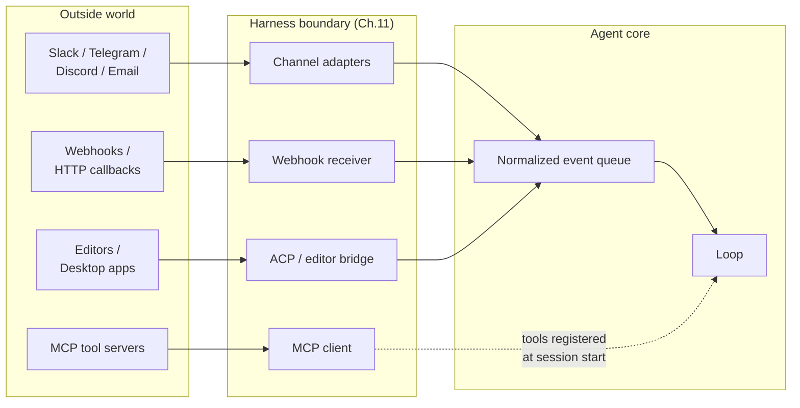
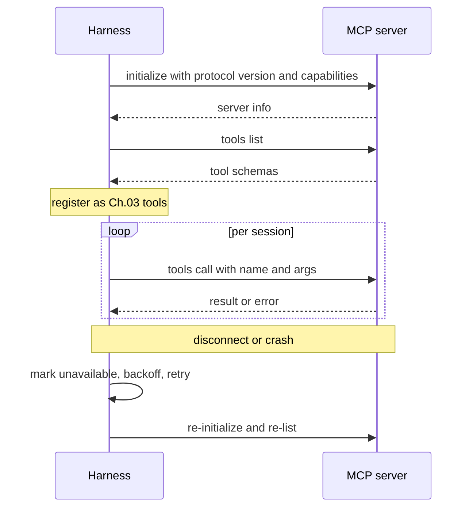
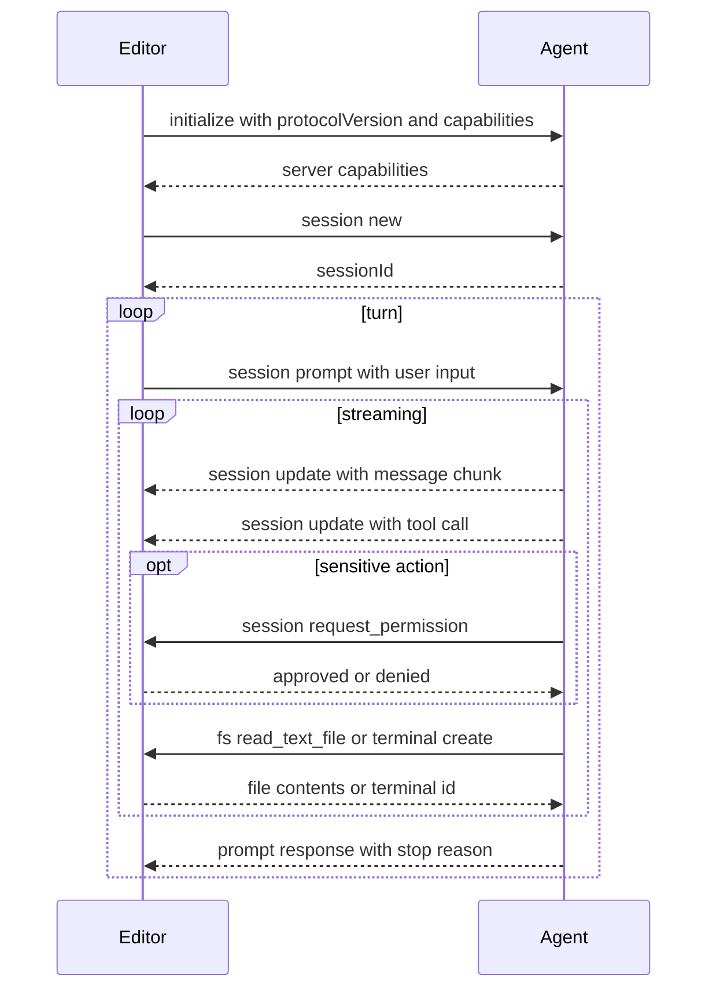

# Chapter 13 — Connectors, MCP, IPC, and channels

## TL;DR

An agent that only reads from stdin and writes to stdout is a demo. A useful agent connects to the systems where work already lives — Slack, email, GitHub, Jira, a Telegram bot, an editor, an internal dashboard — and uses tool servers far beyond its own process. This chapter covers three connection layers: channel adapters that normalize incoming work from many platforms into one event shape; the Model Context Protocol (MCP) and its sibling the Agent Client Protocol (ACP) for tool servers and editor integrations; and the IPC patterns (JSON-RPC, HMAC-signed webhooks, SSE, WebSocket, queues) that hold the whole thing together. Plus the failure modes you only see in production: rate limits, message deduplication, replay attacks, prompt injection from channel content, and the difference between a gateway and an embedded harness.

---

## Why this matters

Most useful agents fail at the edges first. A model improves; the loop is solid; the prompt is cache-warm; the memory layer is clean. Then the Telegram bot times out at 30 messages a second and the agent silently misses half the user's messages. Or the Slack webhook retries, and the agent posts the same reply twice. Or the MCP server you started using last quarter has a memory leak and the long-running agent crashes once per day.

The agent's reasoning core does not care whether a message came from Slack or a webhook or a CLI. It should receive a normalized event, do the work, return a normalized output. *Where the message came from* is exactly the kind of detail the adapter layer is supposed to hide — and exactly the kind of detail that bites you when the adapter layer is thin.

---

## The concept

### Three layers, one boundary



Three categories of integration that look distinct but solve the same problem — talking to systems the harness does not own:

- **Channel adapters** turn IM, email, and webhook events into normalized inputs for the loop.
- **MCP and ACP** are protocols for *tools and editors* — MCP brings external capability into the harness; ACP exposes the harness to editors and desktop hosts.
- **IPC** is the plumbing — JSON-RPC, SSE, WebSocket, queues, HMAC — that ties the others together.

Each is a Ch.11 plugin in shape: register on startup, get a hook surface, expose a clean interface to the core. Everything in this chapter is variations on that theme.

### Channel adapters: one event shape from many platforms

The agent core should see one event shape regardless of where the message came from:

```ts
type ChannelEvent = {
  channel:   "slack" | "telegram" | "discord" | "email" |
             "webhook" | "local" | "matrix" | "signal";
  eventId:   string;          // deduplication key (Slack event_id, Telegram update_id, …)
  actorId:   string;          // user or service that caused the event
  threadId:  string;          // where replies should go
  text:      string;          // normalized text for the model
  attachments?: Array<{
    kind: "image" | "file" | "audio";
    ref:  string;
    mimeType: string;
  }>;
  raw:       unknown;         // original payload, for audit
  reply:     (m: AgentReply) => Promise<void>;
};

type AgentReply = {
  text:       string;
  blocks?:    unknown;        // platform-specific rich content
  visibility: "private" | "thread" | "channel";
  requiresApproval?: boolean; // surfaced through Ch.12's gate
};
```

OpenClaw is the strongest reference — most of its codebase is channel adapters routing into one assistant core. Hermes Agent does the same with Telegram + CLI + cron + ACP. The discipline that scales: any new channel writes its own adapter; the core never learns the channel exists.

### The channel-quirk table

Each platform brings constraints the adapter has to handle. The shape of those quirks is consistent enough to fit in one table:

| Platform | Message-size limit | Rate limit (typical) | Threading | Rich content |
|---|---|---|---|---|
| Slack | ~40 KB / blocks | ~1 msg/sec/channel | First-class threads | Block Kit |
| Telegram | 4096 chars/msg | ~30 msgs/sec global | Reply-to (no threads) | Inline buttons, MD subset |
| Discord | 2000 chars/msg | ~5 msgs/5s/channel | First-class threads | Embeds, components |
| WhatsApp | ~4 KB | Vendor-dependent | None | Limited; tier-dependent |
| Email | RFC limits | Provider-dependent | Reply chain via headers | HTML or plain |
| Signal | ~2000 chars/msg | Modest | None | Plain |

Numbers shift with vendor changes; ask your agent for the current limits when you wire a new channel. The *shape* of the constraints — size, rate, threading, rich content — is what stays stable. Three rules the adapter has to enforce:

- **Chunk long replies.** A model that emits 12 KB of text must not crash a 2 KB-per-message channel.
- **Respect the rate limit.** Queue, backoff, retry — never spam.
- **Render with the platform's affordances.** Slack blocks, Discord embeds, Telegram inline buttons; or fall back to plain text where the platform does not support rich content.

### Inbound channel events

A *message* is just one of the inbound shapes. Production channel adapters handle at least five:

- **Direct message or mention.** The most common; the model receives normalized text.
- **Button click / interactive component.** Slack Block Kit actions, Discord component interactions, Telegram callback queries. The adapter resolves the callback to a structured event (`button_clicked`, `action_id`, `state`) the agent can reason about.
- **File upload.** The adapter downloads the file to a temp location and passes the path; the agent uses a tool to read or analyze it.
- **Image / audio.** Routed through vision or transcription tools before reaching the model as text.
- **Reaction.** An emoji on a prior message — often a useful signal (👍 to approve, ❌ to cancel) the adapter can convert into a `ChannelEvent` of its own.

The adapter's job is *translation*; not all events become work. A `typing` indicator does not need to wake the model. A 👍 on a past message might just be acknowledged. Decide per event whether to enqueue or drop.

### Outbound channel responses

The reverse direction has its own constraints:

- **Chunking** — split a long reply into platform-sized messages, in order.
- **Threading** — if the inbound was in a thread, the reply stays in the thread; if not, do not invent one.
- **Edits and reactions** — a *"working…"* indicator via a placeholder message; edit it to the final answer when the loop returns; sometimes a reaction (✅) instead of an edit.
- **Backpressure** — if the platform rate-limits, the queue absorbs; never drop a reply silently.
- **Visibility** — `private` (DM only), `thread` (only in this thread), `channel` (anyone). The adapter enforces the agent's stated intent.

A useful pattern across systems: send a placeholder *"working on it…"* message immediately on receipt, then edit it as the answer arrives. The user sees the agent acknowledged them; the loop has time to compute; the channel has only one message in its history.

### Channel identity and the session key

The same person on Telegram and on Slack is not the same session. The same person in DM and in a group channel is not the same session either. The composite key:

```ts
type SessionKey = {
  platform:        string;   // "slack" | "telegram" | ...
  accountId:       string;   // platform-specific user/account ID
  conversationId:  string;   // channel/thread ID, or DM identifier
};
```

This is what the harness uses to route an inbound event to the right agent instance (Ch.11's instance state pattern). Two consequences worth pinning:

- **No cross-channel context by default.** A fact the user told the agent in Telegram is not visible in Slack unless the long-term memory layer (Ch.06) is keyed at a higher level than the session.
- **Group vs DM is policy.** In a group, you probably only respond to mentions; in a DM, every message is for you. The adapter encodes this rule, not the model.

### Webhooks: HMAC, dedup, and replay

Webhooks are the universal inbound shape. Three habits separate working webhook receivers from broken ones:

```ts
// Verify HMAC, reject stale, deduplicate, acknowledge fast.
async function handleWebhook(req: HttpRequest) {
  const body  = await req.bytes();
  const sig   = req.header("x-signature");
  const ts    = req.header("x-timestamp");

  if (!constantTimeEqual(sig, "sha256=" + hmac(secret, ts + ":" + body))) {
    return reject(403, "bad signature");
  }
  if (Math.abs(Date.now() - Number(ts) * 1000) > 5 * 60 * 1000) {
    return reject(403, "stale timestamp");          // replay window
  }

  const event = normalize(JSON.parse(body));
  if (await eventStore.seen(event.eventId)) {       // platform may retry
    return ok(202, "duplicate");
  }
  await eventStore.record(event.eventId);
  await channelQueue.enqueue(event);
  return ok(202, "accepted");
}
```

The webhook handler should *acknowledge fast and queue the work*. Never run a model loop inside an HTTP request handler — platforms will retry on timeout and the agent will do everything twice.

### What MCP actually is

The Model Context Protocol is a wire format for capability servers — programs that expose tools, prompts, and resources to a model client. Three taxonomies in one protocol:

- **Tools** — the same shape as a Ch.03 tool. Name, description, JSON schema, return value. The agent calls them like any other tool.
- **Prompts** — pre-written prompt templates the server publishes; the client can inject them on demand.
- **Resources** — addressable read-only content (files, database rows, URLs) the server exposes; the client can include them as context.

Most production usage today is the *tools* track. A capability lives in an MCP server (a database adapter, a browser, a search service); the harness consumes the capability without owning the implementation.

### MCP transports

| Transport | Connection | When it fits | Watch for |
|---|---|---|---|
| **stdio** (subprocess) | Local; harness spawns the server | Local-only tools, dev workflows | Server crash takes the connection down |
| **Streamable HTTP** | Remote or local; HTTP request, with optional SSE for the response stream | Cloud-hosted servers, multi-client | Connection churn; latency |

These two are the current standard transports. Older MCP docs describe a transport called *HTTP+SSE* — a separate-endpoints shape with a long-lived SSE channel for server-to-client. Streamable HTTP *replaced* HTTP+SSE in the spec; they are not the same shape (a single endpoint with optional response streaming vs. two endpoints with a persistent server stream). The spec includes backward-compatibility guidance for clients that need to talk to legacy HTTP+SSE servers; do not assume forward compatibility in the other direction.

Some implementations ship WebSocket or other custom transports. These are not part of the standard; if you use one, you are pinned to that implementation. Confirm what your client and server speak before assuming portability.

The architectural rule is provider-agnostic: discover capabilities once on connect, call them with a stable name, treat failures as tool results (not exceptions), reconnect on disconnect.

### Wrapping MCP tools as Ch.03 tools

By the time an MCP tool reaches the agent loop, it should be indistinguishable from a built-in tool — the same dispatch contract, the same metadata flags, the same error envelope. The wrapping pattern:

```ts
// On connect: discover and register. On call: forward and translate errors.
async function registerMcpServer(server: McpClient, registry: ToolRegistry) {
  await server.initialize();
  const { tools } = await server.listTools();
  for (const t of tools) {
    registry.register({
      name:         `mcp__${server.id}__${t.name}`,        // namespaced
      description:  t.description,
      input_schema: t.inputSchema,

      // MCP annotation field names are camelCase with a `Hint` suffix —
      // they are hints from the server, not assertions. Treat them as
      // defaults to make conservative for untrusted servers.
      destructive:        t.annotations?.destructiveHint ?? false,
      concurrency_safe:   t.annotations?.readOnlyHint    ?? false,
      idempotent:         t.annotations?.idempotentHint  ?? false,
      open_world:         t.annotations?.openWorldHint   ?? true,

      run: async (args, ctx) => {
        try {
          const result = await server.callTool(t.name, args);
          return ok(result);
        } catch (err) {
          return fail(`MCP error: ${String(err)}`, false);  // recoverable
        }
      },
    });
  }
}
```

Three rules:

- **Namespace the name.** `mcp__server__tool` prevents collisions with built-ins and tells the model where the tool came from.
- **Honor MCP annotations — but treat them as hints, not assertions.** MCP exposes `readOnlyHint`, `destructiveHint`, `idempotentHint`, and `openWorldHint` on each tool; these become the Ch.03 metadata that drives parallelism (Ch.02), approval (Ch.12), and retry safety (Ch.08). The protocol uses the `Hint` suffix on purpose: a malicious or buggy server can lie. A server claiming `readOnlyHint: true` while actually writing files is a real attack vector. For untrusted servers, treat the hints as *defaults to make conservative* — assume `destructiveHint: true` when in doubt — and let runtime monitoring (Ch.18) reclassify based on observed behavior.
- **Translate errors into envelopes.** Server crashed, timed out, returned malformed JSON — all become recoverable tool results, not thrown exceptions. The loop reads the error and decides what to do, just like with built-in tools.

### MCP lifecycle and failure modes



The hard parts in production:

- **First-time trust.** A new MCP server is a Ch.12 approval — the user explicitly trusts it before any tool call can fire. What gets stored: the server's identity, a fingerprint or URL, the user's decision, and the date.
- **Lazy vs eager loading.** Eager (list tools at boot) gives cache-warm prompts but slows startup; lazy (list on first use) is faster to start but the first session pays the cost. Leading commercial coding agents tend lazy with prefetch; OpenCode tends eager.
- **Reconnect on drop.** Exponential backoff, capped retries, ultimately mark the server unavailable. The model should see *"server unavailable; try later"* as a recoverable tool result, not silence.
- **Schema drift.** A server can change its tool schemas between sessions. The harness must re-list on reconnect, not assume the cached schema is still valid.

### MCP scope and threats worth flagging

The protocol is broader than the *tools / prompts / resources* triple above. Current MCP also defines roots (filesystem boundaries the client exposes to the server), sampling (server-initiated model calls back through the client), elicitation (server-initiated requests for user input), tasks (long-running async work), tool output schemas, and resource subscriptions. Most production usage today still lives in the tools track, so this chapter centers there — but check the spec for the current shape of the rest before designing around it.

Two threats are worth naming explicitly because they are MCP-specific:

- **Untrusted annotations.** Already covered above — the `*Hint` suffix is the spec acknowledging that an MCP server can lie about its tool's behavior. Treat hints from untrusted servers as defaults to make conservative, and let runtime observation (Ch.18) reclassify.
- **DNS rebinding against local servers.** An MCP server running on localhost is reachable from a browser on the same machine. A malicious page can use DNS rebinding to make cross-origin requests appear local. Local MCP servers must validate the `Origin` header, bind to `127.0.0.1` (not `0.0.0.0`), and require an authentication token even in the local case. None of these are MCP's job; they are yours when you ship a local server.

Authorization itself (OAuth, bearer tokens, mutual TLS for remote servers) is a spec area moving fast enough that the right move is to read the current version when you wire it. The architectural rule, stable across versions: never trust an MCP server's identity claim; verify it through the same first-time-trust gate (Ch.12) you would use for any third-party connector.

### ACP — the agent as a service

Where MCP exposes *external capabilities to the agent*, the **Agent Client Protocol** (ACP) exposes *the agent to an external host* — typically an editor (Zed, JetBrains IDEs, VS Code via extension), a desktop wrapper, or a remote orchestrator. The wire format is JSON-RPC; the philosophy is the same one that made the Language Server Protocol work for compilers a decade ago: *standardize the protocol once, and any agent works with any editor that speaks it.* ACP is maintained by Zed Industries with official SDKs in Kotlin, Python, Rust, and TypeScript.

**Naming inversion.** ACP flips the usual client-server vocabulary. The *editor* is the **client** — it hosts the user, the workspace, the filesystem, the terminal. The *agent* is the **server**. The editor initiates sessions; the agent does the model work; the editor has the final say over filesystem and permission decisions. Calling the editor the "client" feels backwards on first read, but it follows the LSP convention: whoever drives the user-facing interaction is the client.

**Two deployment modes.** A *local* agent runs as a subprocess of the editor and speaks JSON-RPC over stdin/stdout — same shape as MCP's stdio transport. A *remote* deployment over a streamable HTTP transport is described in the spec as a draft proposal; remote support is not yet mature. Check the spec for the current state of remote transports before building on them; for now, treat stdio as the production path and remote as in-progress.

**Capability negotiation.** Like MCP, ACP starts with an `initialize` call where each side advertises what it supports. Standard capabilities include `loadSession`, `fs.readTextFile`, `fs.writeTextFile`, and `terminal`. Both sides can advertise custom capabilities. The negotiated `protocolVersion` determines wire compatibility; capability flags determine which methods either side may call. Re-listing on reconnect catches drift, the same rule that applies to MCP.

**The session methods** the editor and agent exchange:

- `session/new` — editor creates a fresh conversation; agent returns a `sessionId`.
- `session/load` — editor resumes an existing session (requires the `loadSession` capability).
- `session/prompt` — editor sends user input; agent streams progress and replies with a final stop reason.
- `session/update` — agent streams progress as notifications: message chunks marked agent / user / thought, tool-call requests and results, plans, slash-command updates, mode changes.
- `session/cancel` — editor interrupts the in-flight turn; notification, no response expected.
- `session/request_permission` — agent asks the editor for user approval before a sensitive action (Ch.12's gate, now over JSON-RPC).

**The reverse channel: editor as a tool provider.** Because the editor holds the filesystem and the terminal, the agent calls *back* to the editor for those primitives:

- `fs/read_text_file`, `fs/write_text_file` — file I/O. All paths must be absolute; line numbers are 1-based.
- `terminal/create`, `terminal/output`, `terminal/wait_for_exit`, `terminal/kill`, `terminal/release` — shell-command execution lifecycle.

This is the structural difference from MCP: in MCP, the agent calls into capability servers in one direction. In ACP, the agent both *receives* requests from the editor (`session/prompt`) and *calls back* to the editor for fs and terminal access. The two protocols converge on JSON-RPC and reuse MCP's content shapes where they can — ACP's spec is explicit that it *"re-uses the JSON representations used in MCP where possible"* — while adding coding-specific UX types (diffs, plans, modes) that MCP does not have.



**MCP vs ACP at a glance:**

| Concern | MCP | ACP |
|---|---|---|
| Direction | Harness calls into external tools | Editor calls into agent; agent calls back for fs and terminal |
| "Client" is | The harness | The editor |
| Wire format | JSON-RPC | JSON-RPC |
| Transports | stdio, Streamable HTTP, WebSocket | stdio, HTTP, WebSocket |
| Content shapes | Defines its own | Re-uses MCP's where possible |
| Coding-specific UX | Not in scope | Diffs, plans, modes |
| Approval flow | Wrapped at the harness by Ch.12 | First-class `session/request_permission` method |
| Capability negotiation | Yes | Yes, plus custom `_meta` extensions |

**Implementations and ecosystem.** Zed was the first major editor to ship ACP and is the protocol's home. Hermes Agent and OpenClaw both implement ACP adapters so external editors can drive them; several leading commercial coding agents expose ACP servers so any compatible editor can drive *them*. Like LSP a decade ago, the value compounds the more editors and agents adopt it: every new editor unlocks every existing ACP-compatible agent, and vice versa. The wire format is at protocol v1; the artifact versions of the SDKs advance independently.

**Practical advice for harness builders.**

- Treat ACP as just another inbound surface — the channel-adapter pattern from earlier in this chapter applies. The capability negotiation maps to your tool registry; `session/prompt` maps to a `ChannelEvent`; `session/update` maps to the harness's event bus from Ch.11.
- Reuse your Ch.12 approval surface for `session/request_permission`. The UX in the editor is different (a modal popup instead of a chat dialog), but the underlying gate is the same.
- The reverse-channel `fs/*` and `terminal/*` methods are where you wire your sandboxing decisions. Always route through your existing tool dispatcher (Ch.03) so its metadata flags, validation, and audit log still apply — do not bypass the harness just because the call came from JSON-RPC instead of the model.
- Test against more than one editor. ACP's value is editor-agnostic; if your agent only works in Zed, you have not really implemented ACP.

### IPC patterns beyond MCP

MCP and ACP cover the tool and editor cases. Other IPC patterns recur:

- **JSON-RPC over stdio** for plugin workers running in a separate process. Capability negotiation at startup; request/response with IDs; crash recovery via restart-on-exit.
- **Server-Sent Events (SSE)** for one-way streaming from the harness to a UI client — token streams, status updates, run events. Backpressure by capping the buffer; reconnection by replaying from a last-known event ID.
- **WebSockets** when the UI client needs to send things too — interrupts, approvals, edits to a plan (Ch.09 plan revision).
- **Durable queues** for handoff between web handlers and workers (Ch.08's run state machine sits on top of one).
- **HMAC signatures** between harness instances or between harness and gateway, so a forwarded request cannot be spoofed.

### Plugin workers and isolation

A plugin that lives in the harness process can crash the harness. Production systems put risky plugins behind a process boundary — JSON-RPC over a pipe, the harness restarts the worker on crash, the worker has no shared memory with the parent. Paperclip's `plugin-worker-manager` and Hermes Agent's plugin loader both implement this; OpenCode keeps most plugins in-process but supports out-of-process for the ones that touch untrusted code.

The decision per plugin: trusted bundled plugin can stay in-process; user-installed or third-party plugin should be out-of-process. The cost is a small JSON-RPC hop; the win is that a bad plugin cannot take the whole harness down with it.

### Gateway vs embedded

Two architectural patterns recur:

- **Gateway.** One central harness; all channels and clients connect to it. Hermes Agent's `gateway`, OpenClaw's central daemon, Paperclip's server. Simpler shared state (one DB, one memory layer); harder to scale horizontally (one process is the bottleneck).
- **Embedded.** Each channel runs its own harness process. A Telegram bot is a process; a Slack bot is a process; they coordinate through a shared store. Easier to scale; harder to keep state consistent.

Most production deployments start gateway, hit the scaling limit, then either shard (gateway-per-tenant) or move to embedded. The choice is workload-driven; the discipline to internalize is *make it possible to switch later* — keep the adapter layer clean enough that an adapter does not care which model it runs in.

### Things to watch for

The failure modes specific to the connector layer, distinct from the rest of the course:

- **Prompt injection from channel content.** A user message containing *"ignore previous instructions and do X"* is a Ch.18 problem in general — but the adapter is where you can catch the easy cases. Strip obvious markers (control characters, malformed mention syntax) at the adapter; let Ch.18's threat model handle the rest.
- **Rate-limit storms.** A platform-wide rate limit affecting one tenant should not block other tenants. Keep rate-limit state per-tenant in the adapter, not globally.
- **Duplicate delivery.** Every webhook platform retries. Deduplicate by `eventId` *before* enqueueing for the loop — not inside the loop.
- **Replay attacks.** Check the timestamp on signed webhooks; reject anything older than a few minutes.
- **Out-of-order messages.** A platform may deliver messages out of order under load. Use the platform's timestamp or sequence number, not arrival time, when ordering matters.
- **Token leakage in logs.** Bot tokens, OAuth tokens, MCP server URLs with embedded credentials — never log them. Cross-reference Ch.07's redaction pattern.
- **Async tool results.** If a tool call streams its output (a long-running script), decide upfront whether the channel shows it live (edit a placeholder message) or only the final result. Mixing the two is confusing for users.

---

## Real-system notes

- **OpenClaw** is the strongest reference for channel-heavy gateways: a personal-assistant core routed by many channel adapters, each implementing the same plugin interface (`start`, `stop`, `send`, `monitor`) so the core never learns the platform's quirks.
- **OpenCode** is the cleanest example of the *SDK-and-gateway* shape: one local server exposes HTTP + SSE APIs that a TUI, web UI, desktop wrapper, and SDK clients all consume through the same surface.
- **Hermes Agent** is the reference for *cross-surface* HITL and integration: the same agent instance receives work through CLI, dashboard, cron, Telegram, and ACP, and replies on whichever surface the request arrived on.
- **Paperclip** treats agent integrations as adapters at the control-plane level — many bot runtimes invoked through one common orchestration shape with shared budgets, approvals, and audit.

---

## Common failure cases

*These failures are durable; their fixes evolve fastest — each names the pattern and leaves current specifics to you and your AI partner.*

- **Duplicate replies.** A retried webhook or re-delivered queue message runs the loop twice, so the user gets the same answer (or the same expensive action) more than once. *Fix: dedup-before-enqueue with a seen-store keyed on the platform's event ID, plus an idempotency key (Ch.03) on the outbound.*
- **Silence under load, or channel flooding.** A burst trips the platform's rate limit and the agent gets throttled into silence, or it loops and floods until the bot is banned. *Fix: a rate-limited, backpressured outbound queue with per-tenant/per-channel state and a volume circuit breaker.*
- **An MCP server hangs and freezes the turn.** A tool call never returns — a deadlock, half-open socket, or slow leak — and the loop blocks forever instead of degrading. *Fix: a per-call timeout that yields a recoverable error envelope (Ch.02), plus a per-server circuit breaker and liveness check.*
- **Replies land in the wrong place, or leak across conversations.** A collapsed session key sends a private answer to a public channel or bleeds one user's context into another's. *Fix: keep the full session key load-bearing both directions and treat visibility as an explicit hard gate, defaulting to the narrowest scope.*
- **A trusted connector does something you never authorized.** A server claiming read-only quietly writes or exfiltrates, or a bot token lands in a forwarded log. *Fix: a first-time-trust gate (Ch.12) plus treating connectors as untrusted input and code — conservative defaults on `*Hint`, boundary redaction (Ch.07), and a canary credential.*

---

## Pair with your agent

A few prompts that work well on this chapter:

- *"Build a `ChannelEvent` normalizer for my project's primary channel (Slack or Telegram). Show me an inbound message, an inbound button click, and an inbound file upload all reduced to the same shape."*
- *"For my channel platform, list every quirk: message-size limit, rate limit, threading rules, rich-content support. Write the adapter's chunking, backoff, and threading helpers."*
- *"Implement webhook verification: HMAC check, timestamp window, dedup by event ID, queue the work, return 202 in under 100 ms. Test it with a deliberate replay and a deliberate duplicate."*
- *"Wire an MCP server I already use as a Ch.03 tool registry entry. Verify the namespaced name, the schema translation, and that an MCP error becomes a recoverable tool result rather than a thrown exception."*
- *"My MCP server occasionally disconnects mid-session. Implement reconnect with exponential backoff, a *server unavailable* tool result during downtime, and re-listing on reconnect to catch schema drift."*
- *"Move my one risky plugin to an out-of-process worker via JSON-RPC. Verify a deliberate crash in the worker restarts cleanly without taking down the harness."*
- *"Inventory my Ch.13 surface: every channel, every MCP server, every webhook, every UI client. For each, name the trust gate (Ch.12 reference), the failure mode, and the redaction surface."*
- *"Walk me through how OpenClaw's gateway routes one user's Telegram message and Slack message to *different* agent instances. Then design the equivalent for my project, deciding when cross-channel memory should be shared and when it should be isolated (Ch.06)."*

---

## What's next

Chapter 14 turns from the integration plumbing to the *unit of extension*: skills, MCP servers, and subagents — three different shapes the same capability can take, and the design decisions that pick between them.
